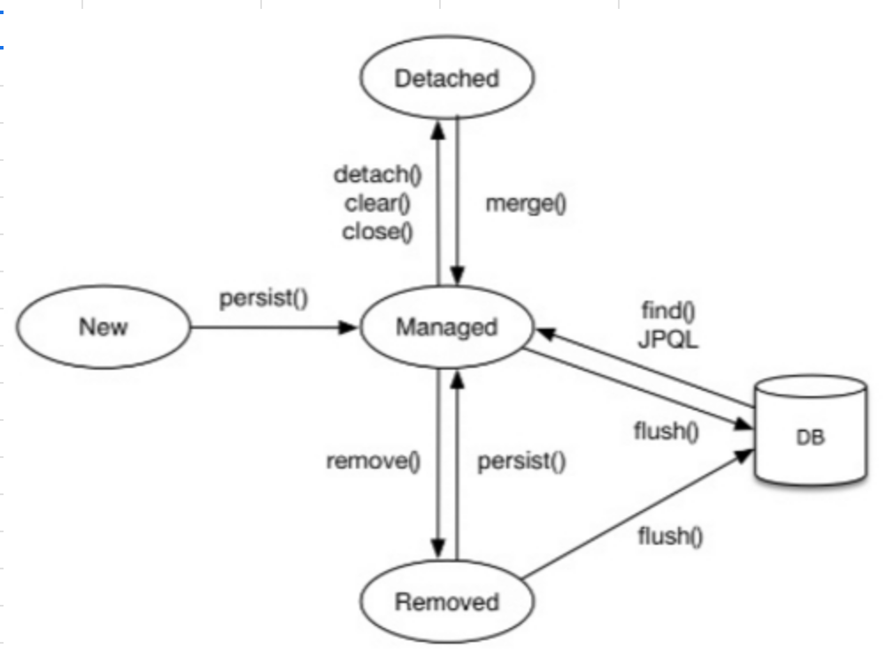

1. [❓JPA 소개 ]
    - 1.1. SQL을 직접 다룰 때 발생하는 문제점
      - 반복적인 CRUD 쿼리 작성
      - SQL에 의존한 개발(개발 다했는데 컬럼 변경되었을 경우...ㅠ)
        - 조회해오는 쿼리에 따라서 Entity 필드에 내용이 있는지 없는지가 결정되니까 Entity를 신뢰할 수 없음 → 쿼리를 다 확인하게 되니까.. 진정한 의미의 계층분할x, 결국 SQL에 의존적인 개발 진행 ing~
    - 1.2. 객체지향과 RDB의 패러다임 불일치 
        1. 상속
           - Q. 객체 상속 O vs RDB 상속 X 
           - A. 기존 SQL 중심으로는 객체상 상속관계인 테이블에 각각에 대한 쿼리문 만드는 작업이 필요. JPA는 ex) `jpa.persist(album)`으로 INSERT INTO ITEM~, INSERT INTO ALBUM~ 쿼리 2개가 수행하는 식으로, 객체중심으로 작업하면 JPA가 알아서 이러한 불일치로 인하여 더 해주어야하는 작업을 수행해줌
        2. 연관관계
           - Q1. 객체 - 참조 VS RDB - FK로 각각 연관관계를 가짐
           - Q2. 객체 단반향 참조, 참조가 존재하는 방향으로만 접근 VS RDB는 FK로 JOIN한 테이블을 양방향으로 조회가능
           - A. JPA가 객체와 RDB사이에서 해당 차이를 해소하는 기능(객체의 참조를 RDB의 FK로하는 SQL 생성, RDB의 테이터 중 RK를 객체의 참조로 하여 ENTITY생성)
        3. 객체그래프 탐색
           - Q. SQL을 직접 다루면, 처음 실행하는 SQL에 따라 객체 그래프의 탐색범위가 정해짐
           - A. JPA는 지연로딩(실제 객체를 사용하는 시점까지 DB조회미룸)으로 객체 그래프를 마음껏 탐색할 수 있음  
        4. 비교 
           - Q. DB는 PK로 ROW를 구분 VS 객체는 == 비교, equals 비교 
           - A. JPA는 같은 트랜젝션일 때 같은 식별자로 조회하는 객체가 동일한 객체임을 보장(equals로 값을 비교해도 == 로 객체 자체를 비교해도 같다는 뜻)
  
    - 1.3. JPA란?

      → ORM이란? Object-Relational Mapping
      
      → ORM 프레임워크는 개발자가 OBJECT와 RDBMS 사이에서 매퍼역할을 하면서 겪는 패러다임의 불일치를 해결해줄수있음 

      → 자바진영에서 이 ORM 기술에 대한 API 표준 명세(인터페이스 모음)를 가지고 있는 겻이 JPA다. JPA를 구현한 ORM 프레임워크 중에 가장 유명한 것이 HIBERNATE!
    
        - WHY JPA?

            1. 생산성 : DB중심이 아니라, 객체중심으로 작업하면 되니까 생산성 올라감
            2. 유지보수 : SQL, JDBC API 코드를 JPA가 대신 해줌! (TABLE COLUMN추가되어도 Entity에 필드만 추가해주면 쿼리 수정할 필요 없고 편함)
            3. 패러다임의 불일치 해결(상속, 연관관계, 객체그래프 탐색, 비교하기 등등)
            4. 성능 : APP과 DB 사이에 계층이 생긴다는 뜻이니까, 최적화 관점에서 시도해볼 수있는 것이 생김
            5. 특정 DBMS에 종속x
            6. 표준이라서 다른 구현기술로 변경가능

2. [JPA 시작]
   - 2.4. 객체 매핑 시작

        <code>

            import javax.persistence.*;

            @Entity
            @Table(name="member")
            class Member() {

                @Id
                @Column(name = "ID")
                private String id;

                @Column(name = "name")
                private String username;

                // 매핑 정보가 없으면 기본 매핑
                private iInteger age;

            }
        </code>

        - @Entity 
            - 클래스를 테이블과 매핑함을 명시
            - @Entity로 정의된 클래스를 엔티티 클래스라고 함
        
        - @Table
            - 엔티티 클래스에 매핑할 테이블 정보를 정의
            - name 속성을 사용하면 테이블명을 지정할 수 있음
            - 생략하면 기본적으로 엔티티 이름을 테이블 이름으로 맵핑
        
        - @Id
            - 테이블 기본 키에 매핑할 엔티티의 필드 지정
            - 식별자 필드라고도 함
        - @Column
            - 필드를 컬럼에 매핑
            - name 속성으로 테이블에 매핑할 컬럼명을 정의
            - 생략하면 기본적으로 필드명이 컬럼명으로 맵핑
            - *만약 대소문자를 구분하는 DBMS를 사용하면 명시적으로 대문자 칼럼명을 맵핑 해주어야 함

    - 2.5. Persistence.xml 
      - EMF와 DB Connection 생성을 위한 정보가 있는 곳
      - JPA표준속성 : javax.prsistence
      - hibernate전용속성 : hibernate
        → hibernate.dialect : 특정 DBMS 방언의 사용으로 해당 DBMS에만 종속되지 않도록 hibernate의 설정

    - 2.6. JPQL
      - JPA가 제공하는 SQL을 추상화한 객체지향 쿼리 언어

        → 차이점? JPQL은 엔티티 객체 대상, SQL은 DB TABLE 대상으로 쿼리함 : JPQL은 DB TABLE을 모름

        `em.createQuery(JPQL, 반환타입)` → `getResultlist()`

3. [영속성 관리 : EntityManager 사용법]
    - 3.1. EntityManagerFactory 🏭
      - EntityManager**Factory**는 EntityManager를 만드는 공장이다.
  
        `EntityManagerFactory emf = Persistence.createEntityManagerFactory("jpabook"); `
      - META-INF/Persistence.xml의 정보를 바탕으로 EMF와 DB Connection Pool을 생성한다.(hibernate 기준)
      - 공장은 짓는데 비용 high → 1개만 만들어서 App전체에서 공유하도록 설계되어 있음! (DB가 1개인 경우임! 그 외의 경우는 아직 모름)
      - 여러 스레드가 동시 접근해도 안전! 
      - EntityManager 😜는 만드는데 비용 low

        `EntityManager em    = emf.createEntityManager();`
      - 스레드 간에 공유 절대 금지!(동시성 문제 발생)
      - DB 연결이 꼭 필요한 시점까지 커넥션을 획득하지 않음(ex. 트랜젝션 시작)

    - 3.2. EntityManager의 Persistence Context🚪
        - EntityManager가 생성될 때, Persistence Context라는 공간도 생김
        - EntityManager는 요 공간에 Entity를 보관/관리함!

            `em.persist(member);`
        - 여러 EntityManager가 같은 Persistence Context에 접근할수도 있다고는 함 ! 11장에서 to be continue..
    - 3.3. Entity의 LifeCycle ♻️
        1. 비영속    : 관계없음(Entity 객체 생성)
        2. 영속      : Persistence Context에 저장된 상태    
            `em.persist(member);`  
            `em.find()`   (DB에서 조회해서 Persistence Context에 저장) 
            JPQL 사용으로 Persistence Context에 저장
        3. 준영속    : Persistence Context에 저장 → **분리**된 상태  
            `em.detach(member);` detach로 영속성 컨텍스트에서 Entity 분리 
            `em.clear();`  영속성 컨텍스트가 초기화되어도 분리될 것 
            `em.close();`  영속성 컨텍스트가 닫히면 분리되겠지
        4. 삭제      :  
            `em.remove(member);`

        

    - 3.4. Persistence Context 특징

        1. 식별자값(@id)이 테이블의 PK와 같은 존재라서 NOT NULL
        2. flush : 영속성 컨텍스트의 변경 사항을 DB에 반영하는 것
        3. 엔티티 CRUD시 알수있는 영속성 컨텍스트의 장점! 

           → 1차 캐시, 동일성보장, 트랜잭션을 지원하는 쓰기 지연, 변경 감지, 지연로딩 

        - 1차 캐시와 **Entity 조회**

            - 1차캐시 : 영속성 컨텍스트 내부에 Entity가 저장되는 곳
            
                → Entity를 영속 == 1차캐시에 저장

                → 키 : DB의 PK, 값 : Entity Instance
            - Entity 조회 과정의 1차캐시 

                // 엔티티를 생성한 상태(비영속) 
                `Member member = new Member();`  
                `member.setId("member1");` 
                `member.setUsername("회원1");` 
                // 영속상태(1차캐시에 담기)  
                `em.persist(member);`  
			    // 1차 캐시에서 조회 
			    `Member findMember = em.find(Member.class, "member1");` 
                → 1차 캐시에 존재하지 않는 엔티티를 조회한 경우, DB에서 조회 
                → DB에서 조회한 데이터로, 엔티티 생성하여 1차캐시에 저장(영속상태) 
			    → 해당 엔티티를 반환 
			
            - 영속 Entiity의 동일성(==) 보장 
              → 영속성 컨텍스트가 1차 캐시를 활용하기 때문에, 엔티티의 동일성을 보장할 수 있음 ( 동일 = 인스턴스 같음, 동등 인스턴스의 값이 같음)		
              <pre>
                <code>
                Member a = em.find(Member.class, "member1");		
                Member b = em.find(Member.class, "member1");		
                // 1차 캐시에 저장되어있는 Member객체의 인스턴스를 return 하니까...	
                System.out.print(a==b) // true	
                </code>
              </pre>	
              - 1차 캐시로 반복가능한 읽기(REPEATABLE READ) 등급의 트랜젝션 격리 수준을, DB가 아닌 APP차원에서 제공 ( 이건 나중에...)	

        - **Entity 등록**시, 트랜젝션을 지원하는 쓰기 지연 (**쓰기 지연 SQL 저장소**)	 		
          - **쓰기지연** : `em.persist(member)`를 사용해 member를 저장해도 바로 INSERT SQL이 DB에 보내지는 것이 아니다.  
            엔티티 매니저는 트랜잭션을 커밋하기 직전까지 내부 쿼리 저장소에 INSERT SQL을 모아둔다.  
            그리고 트랜잭션을 커밋할 때 모아둔 쿼리를 DB에 보낸다(flush).  
            이것을 트랜잭션을 지원하는 쓰기 지연이라 한다.	 
            <pre>
                <code>
            tx.begin();		
            // 1차 캐시 저장 & entity 분석 후 SQL 생성->쓰기 지연 SQL저장소에 SQL문 저장
            em.persist(member1);		
            em.persist(member2);		
            // 쓰기 지연  SQL 저장소에 저장된 SQL문 DB에 전달
            tx.commit(); 
                </code>
            </pre>
			
        - **Entity 수정**시, **변경감지** 	
            <pre>
                <code>
            Member findMember = em.find(Member.class, "member1");		
            findMember.setName("newName");		
            
            // em.persist(findMember) 할 필요 없음		
            // 트랜잭션 commit 시에 setName에 대한 update 쿼리 db로 날라감		
            tx.commit(); 
                </code>
            </pre>
			
	        [변경감지의 흐름]		
           	1. 트랙잭션을 커밋하면 엔티티 매니저 내부에서 먼저 플러시가 호출된다.		
           	2. 엔티티와 스냅샷(영속성 컨텍스트에 들어온 최초 시점의 값)을 비교하여 변경된 엔티티를 찾는다.		
           	3. 변경된 엔티티가 있으면 수정 쿼리를 생성해서 쓰기 지연 SQL 저장소에 저장한다.		
           	4. 쓰기 지연 저장소의 SQL을 플러시(DB에 전달)한다.		
           	5. 데이터베이스 트랜잭션을 커밋한다.		
			
        - **Entity 삭제** 
            - 수정과 동일하게 변경감지하여, delete쿼리를 쓰기 지연 SQL저장소에 저장		
         	 - 트랜잭션 커밋시에 쓰기지연 저장소의 SQL 플러시되면서, Entity 삭제된다.
        <pre>
            <code>
            Member member! = em.find(Member.class, "memberA"); 	
            em.remove(memberA); // 엔티티 삭제	 
            </code>
        </pre>
  	    
    - 3.5. FLUSH : 영속성 컨텍스트의 변경 내용을 DB에 반영 

        1. 옵션 2개(EntityManager에 직접 설정 가능)
           - FlushModeType.AUTO    : 커밋이나 쿼리 실행시(default)
           - FlushModeType.COMMIT : 커밋할 때만
        2. flush가 시작되면? 

            → 변경감지 동작  → 영속성 컨텍스트 내의 변경된 엔티티 찾기(스냅샷과 비교)  → 수정사항 반영할 수정 쿼리 생성하여 지연 SQL저장소에 등록  → 쓰기지연SQL저장소의 쿼리를 DB로 전송

        3. flush 호출되는 3가지 경우
           1. 직접 호출 `em.flush()`
           2. 트랜잭션 commit으로 자동 호출 
              - sql dml 치고 commit하듯이, 트랜잭션 commit전에 변경사항 DB에 반영하는 것임
           3. JPQL 실행으로 자동호출 
              - WHY? 아래 코드에서 query.getResultList로 member tabe에서 memberA,B,C를 조회하려면, 트랜잭션 전에 flush해야함. 
                <code>
                    em.persist(memberA); 
                    em.persist(memberB); 
                    em.persist(memberC);  
                    query = em.createQuery("select m from Member m", Member.class); 
                    List<Member> members = query.getResultList();
                </code>
           
    - 3.6. 준영속 : 영속성 컨텍스트의 기능 사용 불가
      * 식별자값 가지고 있음
      * 병합: merge() **비/준영속객체를 '새로운' 영속객체로 반환