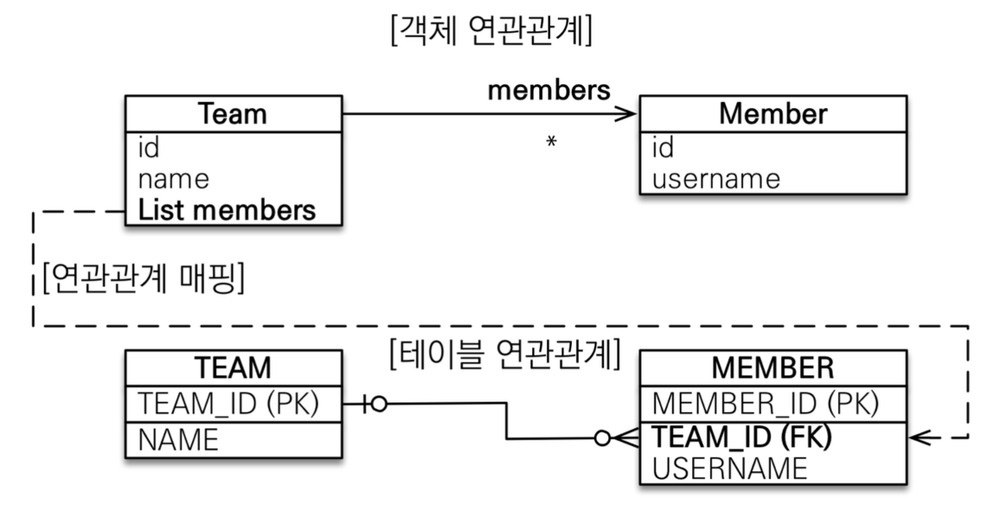
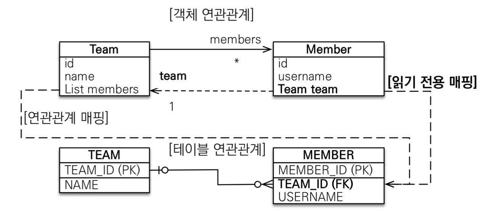
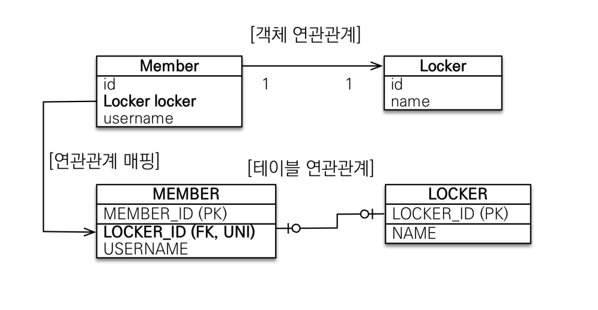
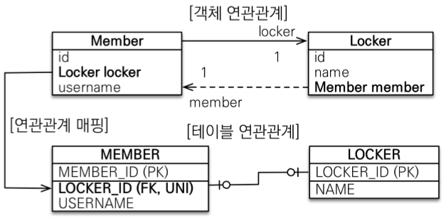
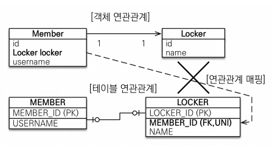
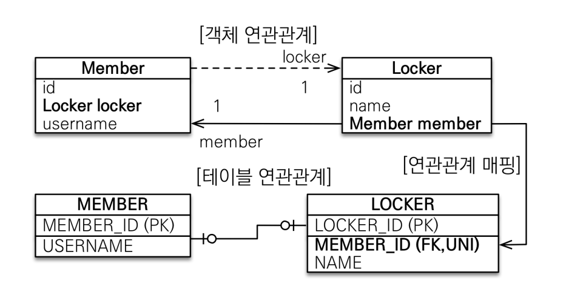
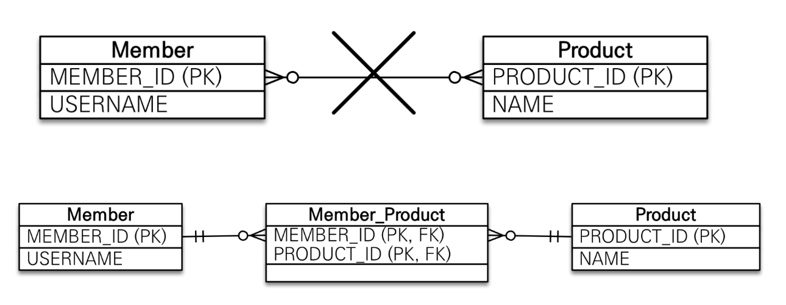
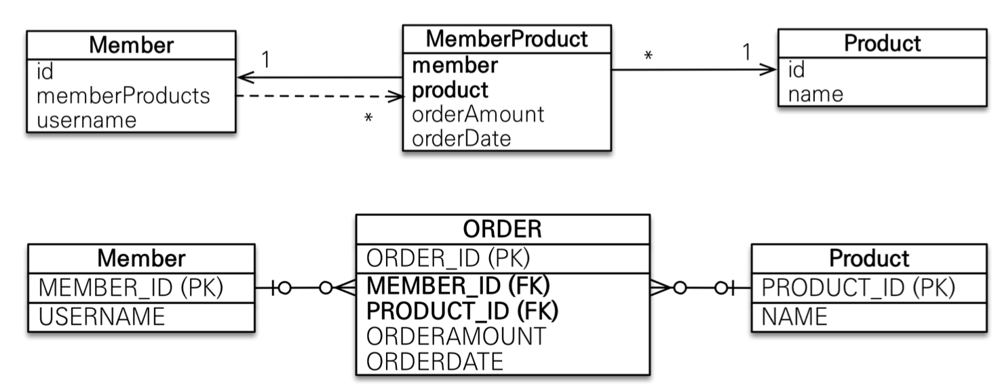

 # 06. 다양한 연관관계 매핑
 - 고려사항 3가지? : 다중성, 단방향/양방향, 연관관계의 주인 
 ## 6.1. 다대일
 - DB설계상, 1과 N의 관계에서 외래키는 늘 N쪽에 존재한다.<br/>따라서 연관관계의 주인(FK관리자)은 늘 N쪽이다.
 ### 6.1.1 다대일 단방향 (1:N)
 - 팀(1)과 회원(N)의 관계 예시
 ```java
    @Entity
    public class Member{
        @Id @GeneratedValue
        @Column(name = "MEMBER_ID")
        private Long id;

        private String username;

        @ManyToOne // 다대일
        @JoinColumn(name = "TEAM_ID") // 해당 필드를 FK인 TEAM_ID와 매핑 
        private Team team; 

        // Getter... Setter...
    }

    @Entity
    public class Team{
        @Id @GeneratedValue
        @Column(name = "TEAM_ID")
        private Long id;

        private String name;

        // Getter... Setter...
    }
 ``` 
### 6.1.2 다대일 양방향 (N:1, 1:N)
 - 기존 (6.1.1)다대일 단방향에 연관관계의 주인이 아닌 쪽에 읽기를 위한 참조를 하나 추가해주는 것
 - 양방향은 외래키가 있는 쪽이 연관관계의 주인
 - 양방향 연관관계는 항상 서로를 참조해야한다. 연관관계 편의 메소드 권장
 ```java
    @Entity
    public class Member{
        @Id @GeneratedValue
        @Column(name = "MEMBER_ID")
        private Long id;

        private String username;

        @ManyToOne // 다대일
        @JoinColumn(name = "TEAM_ID") // 해당 필드를 FK인 TEAM_ID와 매핑 
        private Team team; 

        public void setTeam(Team team){ // 연관관계 편의 메소드
            this.team = team;
            // 무한루프에 빠지지 않도록 체크
            if(!team.getMembers().contains(this)){
                team.getMembers().add(this);
            }
        }
    }

    @Entity
    public class Team{
        @Id @GeneratedValue
        @Column(name = "TEAM_ID")
        private Long id;

        private String name;

        @OneToMany(mappedBy = "team")
        private List<Member> members = new ArrayList<Member>();

        public void addMember(Member member){
            this.members.add(member);
            if(member.getTeam() != this){ // 무한루프에 빠지지 않도록 체크
                member.setTeam(this);
            }
        }
    }
 ``` 
 ## 6.2. 일대다
 - 1:N 관계는 엔티티를 하나 이상 참조할 수 있으므로</br>자바 컬렉션인 Collection, List, Set, Map 중에 하나를 사용해야한다. 
 ### 6.2.1 일대다 단반향 - JPA 2.0부터 지원
  <br/>
 - 1:N의 관계에서 외래키는 N쪽 테이블에 존재하는데,<br/> 위 이미지에서는 N에 해당하는 Member 엔티티에 외래키를 매핑할 수 있는 참조 필드가 없다. <br/>대신 1에 해당하는 Team 엔티티에만 참조 필드인 members가 있다.
 - **외래키가 존재하는 테이블의 반대편에서 외래키를 관리하는 특이한 모습이다.**
  
  ```java
@Entity
public class Team{
    @Id @GeneratedValue
    @Column(name = "TEAM_ID")
    private Long id;

    private String name;

    @OneToMany // 일대다
    @JoinColumn(name ="TEAM_ID") // MEMBER 테이블의 TEAM_ID(FK)
    private List<Member> members = new ArrayList<Memeber>();
   
    //일대다 단방향 관계 매핑시 @JoinColumn을 명시
    //그렇지 않으면, JPA는 연결 테이블을 중간에 두고 연관관계를 관리하는 
    //조인 테이블 전략을 기본으로 사용하여 매핑할 것
    
}

@Entity
public class Member{
    @Id @GeneratedValue
    @Column(name = "MEMBER_ID")
    private Long id;

    private String username;
}
  ```
 - 단점? </br>매핑한 객체가 관리하는 외래키가 다른 테이블에 있다는 점 때문에 성능 문제도 있고 관리도 부담스럽다.</br>일대다 단방향 매핑보다는 다대일 양방향 매핑을 권장</br>
  ex) 연관관계 처리를 위한 update sql 추가 실행 필요

 ### 6.2.2 일대다 양방향(1:N, N:1) : 다대일 양방향 권장

<br/>

 - 일대다 **양방향**이라고하면, 1이 연관관계의 주인(FK관리자) 다(N)가 연관관계의 주인이 아닌 관계이다.
 - 그런데 관계형 데이터베이스상 다(N)쪽이 늘 연관관계의 주인이 되기때문에</br>다쪽에 사용되는 @ManyToOne에는 연관관계의 주인이 아님을 나타내는 mappedby 속성이 없다.
 - 일대다 양방향을 객체로 구현한다면 : 일대다 단방향 → (+) ←다대일 단방향 매핑(읽기 전용)

```java
@Entity
public class Team{ // 1쪽인 Team 테이블 매핑 객체(일대다 단방향 그대로)
    @Id @GeneratedValue
    @Column(name = "TEAM_ID")
    private Long id;

    private String name;

    @OneToMany // 일대다 
    @JoinColumn(name ="TEAM_ID") // MEMBER 테이블의 TEAM_ID(FK)
    private List<Member> members = new ArrayList<Memeber>();
}

@Entity
public class Member{ // N쪽인 Member 테이블 매핑 객체
    @Id @GeneratedValue
    @Column(name = "MEMBER_ID")
    private Long id;
    private String username;

    @ManyToOne // 다대일 매핑, mappedby 속성이 존재하지 않음
    @JoinColumn(name = "TEAM_ID", insertable = false, updatable = false) // 읽기전용으로
    private Team team;
}
```
 ## 6.3. 일대일
 - 특징<br/>
1) 일대일 관계는 그 반대도 일대일 관계
2) 일대일 관계는 주 테이블이나 대상 테이블 둘 중 어느곳이나 외래키를 가질 수 있다.
 ### 6.3.1 주 테이블에 외래키
 - 외래 키를 객체 참조와 비슷하게 사용할 수 있어서, 객체 지향 개발자들이 선호
 - 주 테이블만 확인해도 대상 테이블과 연관관계가 있는 지 알수 있음
 #### 단방향, 양방향
 <div style="display:flex;">
    
    
 </div>

```java
@Entity
public class Member{
    @Id @GeneratedValue
    @Column(name = "MEMBER_ID")
    private Long id;

    private String username;

    @OneToOne
    @JoinColmn(name = "LOCKER_ID")
    private Locker locker;
}
@Entity
public class Locker{
    @Id @GeneratedValue
    @Column(name = "LOCKER_ID")
    private Long id;

    private String name;

    // 대상 테이블인 Locker 객체에 아래 참조 필드를 추가하고
    // @OneToOne(mappedBy = "locker")를 명시하여 
    // member 객체의 locker 필드에서 외래키를 관리한다는 것을 표시하면, 양방향이 된다.
    @OneToOne(mappedBy = "locker") 
    private Member member;
}
```
 ### 6.3.2 대상 테이블에 외래키
 ### 단방향, 양방향
 - 대상 테이블에 외래키가 있는 일대일 단방향 관계 JPA지원 x 
 - 일대일 매핑에서 대상테이블에 외래키를 두고 싶다면, 양방향으로 매핑한다. <br/>주 엔티티 대신 대상 엔티티를 연관관계의 주인으로 만든다.
 - 테이블 관계를 일대일에서 일대다로 변경할 때 테이블 구조를 그래로 유지할 수 있다는 장점 있음
<div style="display:flex;">
    
    
 </div>

```java
@Entity
public class Member{
    @Id @GeneratedValue
    @Column(name = "MEMBER_ID")
    private Long id;

    private String username;

    @OneToOne(mappedBy = "member")
    private Locker locker;
}
@Entity
public class Locker{
    @Id @GeneratedValue
    @Column(name = "LOCKER_ID")
    private Long id;

    private String name;

    @OneToOne
    @JoinColumn(name = "MEMBER_ID")
    private Member member;
}
```
 ## 6.4. 다대다(실무에서 거의 사용x)
<br/>
 - 테이블 관계에서는 정규화된 테이블 2개로 다대다 관계를 표현할 수 없고, <br/> 중간에 연결 테이블을 추가해야 한다.
 - 객체는 테이블과 다르게 객체 2개로 다대다 관계를 만들수 있다.
  
 #### 6.4.1 다대다 : 단방향
```java
@Entity
public class Member{
    @Id @GeneratedValue
    @Column(name = "MEMBER_ID")
    private Long id;

    private String username;

    @ManyToMany // 다대다
    @JoinTable(name = "MEMBER_PRODUCT",
               joinColumns = @JoinColumn(name = "MEMBER_ID"),
               inverseJoinColumns = @JoinColumn(name = "PRODUCT_ID")) // 연결 테이블을 바로 매핑
    private List<Product> products = new ArrayList<Product>();
}
@Entity
public class Product{
    @Id @GeneratedValue
    @Column(name = "PRODUCT_ID")
    private Long id;

    private String name;
}
```
 #### 6.4.2 다대다 : 양방향
```java
@Entity
public class Product{
    @Id @GeneratedValue
    @Column(name = "PRODUCT_ID")
    private Long id;

    private String name;

    @ManyToMany(mappedBy = "products") // 역방향 추가하여 양방향으로 만듬
    private List<Member> members;
}
```
아래는 회원 엔티티에 추가할 연관관계 편의 메소드
```java
    public void addProduct(Product product){
        products.add(product); // 회원이 주문한 상품 추가
        product.gettMembers().add(this); // 상품에 주문한 회원 추가
    }

    // member.addProduct(product); 만 하면 회원과 상품 객체 둘다 추가된다.
```
 #### 6.4.3 다대다 : 매핑의 한계와 극복, 연결 엔티티 사용
 <br/>
 - 실무에서는 연결 테이블에 여러 컬럼이 추가되는 경우가 많아 @ManyToMany를 사용할 수 없다.
 - 결국 엔티티 간의 관계도 테이블 관계처럼 다대다에서 일대다, 다대일 관계로 풀어야한다.
  
```java
@Entity
public class Member{
    @Id @GeneratedValue
    @Column(name = "MEMBER_ID")
    private Long id;

    private String username;

    @OneToMany(mappedBy = "member") // 일대다, 연관관계 주인 x
    private List<MemberProduct> memberProducts;
}

@Entity
@IdClass(MemberProductId.class) // 1. 식별자 클래스 지정
public class MemberProduct{
    @Id 
    @ManyToOne
    @JoinColumn(name = "MEMBER_ID")
    private Member member; // 2. MemberProductId.member 와 연결

    @Id
    @ManyToOne
    @JoinColumn(name = "PRODUCT_ID")
    private Product product; // 3. MemberProductId.product 와 연결

    private int orderAmount;
}

public class MemberProductId implements Serializable{
    private String member;
    private String product;

    // hashCode and equals
}
```
- **복합 기본키** <br/>
- 회원상품 엔티티는 기본키가 MEMBER_ID와 PRODUCT_ID로 이루어진 복합 기본키다.
- JPA에서 복합키를 사용하려면, 별도의 식별자 클래스를 만들어야 함
1) 복합 키는 별도의 식별자 클래스로 만들어야한다.
2) Serializable을 구현
3) equals와 hashCode 메소드를 구현
4) 기본생성자가 있어야한다.
5) 식별자 클래스는 public 이어야 한다.
6) @IdClass를 사용하는 방법 외에 @EmbeddedId를 사용하는 방법도 있다.
- **식별관계** <br/>
- 식별관계 : 부모 테이블의 기본키를 받아서 자신의 기본키 + 외래키로 사용하는 것 

 #### 6.4.4 다대다 : 새로운 기본 키 사용
- DB에서 생성해주는 대리키를 Long값으로 사용하는 것.
 ```java
 @Entity
public class Order{
    @Id @GeneratedValue
    @Column(name = "ORDER_ID")
    private Long id;

    @ManyToOne
    @JoinColumn(name = "MEMBER_ID")
    private Member member; 

    @ManyToOne
    @JoinColumn(name = "PRODUCT_ID")
    private Product product; 

    private int orderAmount;
}
 ```
 #### 6.4.5 다대다 연관관계 정리
- 다대다 관계를 일대다 다대일 관계로 풀기 위해 연결 테이블을 만들 때,<br/>식별자를 어떻게 구성할지 선택해야한다.
- 식별관계 : 받아온 식별자를 기본키 + 외래키로 사용
- 비식별관계 : 받아온 식별자는 외래키로만 사용하고 새로운 식별자를 추가(추천)


