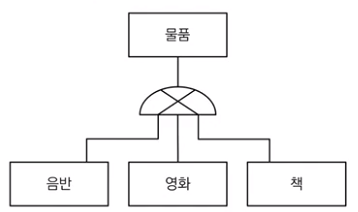
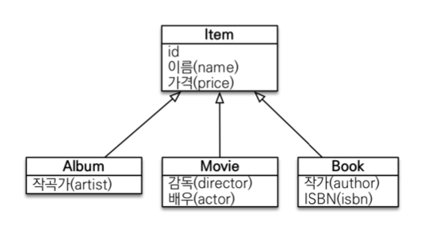
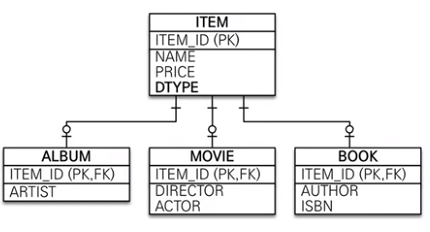
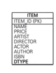
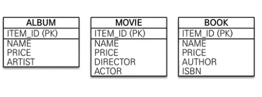
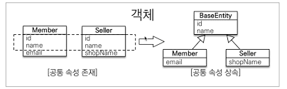
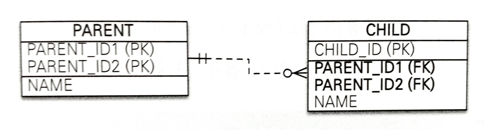
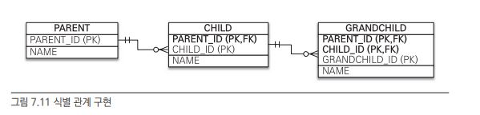
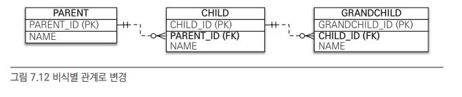
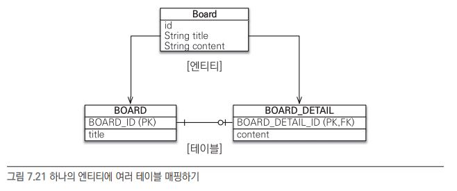

# CH07.고급매핑
## 7.1 상속 관계 매핑
 관계형 데이터베이스에는 객체지향언어의 "상속"이라는 개념이 없다.<br/>
 다만, 슈퍼타입/서브타입 관계 모델링 기법이 객체의 상속과 유사하다. <br/>
 **∴ JPA에서 상속관계 매핑이란?**<br/>
 **객체의 상속과 DB의 슈퍼타입/서브타입 관계를 매핑**하는 것이다. 

▼ 슈퍼타입/서브타입 논리 모델링</br>


▼ 객체의 상속관계도</br>

<br/>

DB입장에서 슈퍼타입/서브타입 논리모델을 물리모델로 구현하는 방법 : 3가지 <br/>
    1) [각각의 테이블로 변환](#711-조인-전략) <br/>
    2) [통합 테이블로 변환](#712-단일-테이블-전략) <br/>
    3) [서브타입 테이블로 변환](#713-구현-클래스마다-테이블-전략) <br/>

### 7.1.1 조인 전략
- 슈퍼타입/서브타입 논리모델을 각각의 테이블로 변환하는 방법으로 구현한 경우,<br/>
<br/>
객체와 매핑하려면 @Inheritance(strategy = InheritanceType.JOINED) 사용! 

```java
    @Entity
    @Inheritance(strategy = InheritanceType.JOIND) // 1. 부모클래스에 상속매핑
    @DiscriminatorColumn(name = "DTYPE") // 2.구분 컬럼. (Discriminator:판별자) name default DTYPE
    public class Item{
        @Id @GeneratedValue
        @Column(name = "ITEM_ID")
        private Long id;
        private String name;
        private int price;
        ...
    }

    @Entity
    @DisciriminatorValue("M") // 3.구분값 Item테이블의 DTYPE컬럼에 M이들어있다면, Movie테이블과 연결
    public class Movie extends Item{
        // Item class 의 id, name, price 상속
        private String director;
        private String actor;
    }

    @Entity
    @DisciriminatorValue("B") // 구분값
    @PrimaryKeyJoinColumn(name = "BOOK_ID") // 4.상속받은 부모테이블의 ID컬럼명을 그대로 사용하고 싶지 않다면, @PrimaryKeyJoinColumn으로 재정의
    public class Book extends Item{
        // Item class 의 id, name, price 상속
        private String author;
        private String isbn;
    }
```
- 장점 : 테이블이 정규화됨</br>
  효율적인 저장공간 사용</br>
  외래키 참조 무결성 제약조건 활용가능(ex. 영화의 가격합계 구하기 위해 item테이블만 조회해도됨)
- 단점 : 조회할 때 조인이 많이 사용되므로 쿼리가 복잡하고 성능이 저하될 수 있다.</br>
  데이터를 등록할 때 insert sql을 2번 실행(자식, 부모 테이블에 각각 1번씩)

### 7.1.2 단일 테이블 전략
 - 논리 모델링 상의 슈퍼타입/서브타입을 모두 하나의 테이블에 구현</br>
   DTYPE 컬럼으로 어떤 자식 데이터가 저장되었는지 구분</br>
   <br/>
 - 테이블이 1개라서 조인하지 않으니 일반적으로 조회 속도가 빠르다.
 - 자식 엔티티가 매핑된 컬럼은 모두 nullable이어야 한다.
 - 코드는 @Inheritance(strategy = InheritanceType.SINGLE_TABLE) 제외하고는 조인전략과 동일</br>

```java
    @Entity
    @Inheritance(strategy = InheritanceType.SINGLE_TABLE) // 1. 부모클래스에 상속매핑
    @DiscriminatorColumn(name = "DTYPE") // 2.구분 컬럼. (Discriminator:판별자) name default DTYPE
    public class Item{
        @Id @GeneratedValue
        @Column(name = "ITEM_ID")
        private Long id;
        private String name;
        private int price;
        ...
    }

    @Entity
    @DisciriminatorValue("M") // 3.구분값 Item테이블의 DTYPE컬럼에 M이들어있다면, Movie테이블과 연결
    public class Movie extends Item{ ... }

    @Entity
    @DisciriminatorValue("B") // 4. @DiscriminatorValue를 지정하지 않으면, default 엔티티 이름(Book)
    public class Book extends Item{ ... }

    @Entity
    @DisciriminatorValue("A") 
    public class Album extends Item{ ... }
```
 - 장점 : 조인이 필요하지 않아서 쿼리가 단순하고 조회 성능이 빠르다.
 - 단점 : 자식 엔티티가 매핑한 컬럼은 모두 nullable</br>
 단일 테이블에 모든 것을 저장하기 때문에 테이블이 커질 수있다.</br>
 그래서 상황에 따라서는 조회성능이 오히려 느려질 수 있다.

### 7.1.3 (서브타입)구현 클래스마다 테이블 전략
 - 논리 모델링의 자식 엔티티마다 테이블을 구현(일반적으로 비추)
 - 자식 테이블 각각에 필요한 컬럼이 모두 존재</br>
  <br/>

```java
    @Entity
    @Inheritance(strategy = InheritanceType.TABLE_PER_CLASS) // 1. 부모클래스에 상속매핑
    // 2. 구분컬럼 필요없음
    public class Item{
        @Id @GeneratedValue
        @Column(name = "ITEM_ID")
        private Long id;
        private String name;
        private int price;
        ...
    }

    @Entity
    // 3.구분값 필요없음
    public class Movie extends Item{ ... }

    @Entity
    public class Book extends Item{ ... }

    @Entity
    public class Album extends Item{ ... }
```
- 장점 : 서브 타입을 구분하여 처리할 때 효과적</br>not null 제약조건 사용가능
- 단점 : 여러 자식 테이블을 함께 조회하려면 union 사용해야 해서 조회 성능 느리다</br>
  자식 테이블을 통합해서 조회하기 어렵다.(비추 이유)

## 7.2 @MappedSuperclass
- 부모클래스는 테이블과 매핑하지 않고, </br>부모클래스를 상속받는 자식클래스에게 매핑 정보만 제공하고 싶을 때 사용. (추상 클래스와 비슷)</br>
<br/>
- 위 이미지의 Member, Seller 객체에서 공통 속성인 id, name을 부모클래스인 BaseEntity로 모으고<br/>Member, Seller는 BaseEntity를 상속받아서 공통 속성을 사용한다.
- 부모로부터 상속받은 매핑정보를 재정의하려면,</br>@AttributeOverride(name = "재정의할 부모의 필드명", column = @Column(name="재정의할 컬럼명"))
- 매핑정보 여러개를 재정의하려면 @AttributeOverrides 사용
  
```java
    @MappedSuperClass // @Entity로 테이블과 매핑하지 않음
    public abstract class BaseEntity{
        private Long id;
        private String name;
    }

    @Entity
    @AttributeOverrides({
        @AttributeOverride(name = "id", column = @Column(name="MEMBER_ID")),
        @AttributeOverride(name = "name", column = @Column(name="MEMBER_NAME"))
    })
    public class Member extends BaseEntity{
        // BaseEntity의 id, name 상속
        private String email; 
    }

    @Entity
    public class Seller extends BaseEntity{
        // BaseEntity의 id, name 상속
        private String shopName;
    }
```
- @MappedSuperClass로 지정한 클래스는 엔티티가 아니다<br/>
→ em.find()나 JPQL에서 사용할 수 없다.
- @MappedSuperClass로 지정한 클래스는 직접 생성해서 사용할 일이 거의 없다.</br>
→ 추상클래스로 만들자.

+) **!! @Entity는 @Entity이거나 @MappedSuperClass로 지정한 클래스만 상속받을 수있다.**

## 7.3 복합 키와 식별 관계 매핑
 - 복합키를 매핑하는 방법, 식별관계/비식별관계를 매핑하는 방법
  
### 7.3.1 식별 관계 vs 비식별 관계
- 데이터베이스 테이블을 설계할 떄, 식별관계나 비식별관계 중 하나를 선택해아한다.
- 최근에는 비식별 관계를 주로 사용하고 꼭 필요한 곳에만 식별관계를 사용하는 추세 
  
|1. 외래키가 기본키에 포함|2. 외래키에 null허용|
|------|---|
|O : 식별 관계|-|
|X : 비식별 관계|O : 선택적 비식별 관계|
||x : 필수적 비식별 관계|

### 7.3.2 복합 키 : 비식별 관계 매핑
  **1) 복합키** 
 - 복합키를 사용하려면, 별도의 식별자 클래스를 만들고, equals와 hashCode를 구현해야 한다.
 - JPA는 영속성 컨텍스트에 엔티티를 보관할 때, 엔티티의 식별자를 키로 사용하는데</br>
 식별자 구분을 위해 equals와 hashCode를 사용하여 동등성 비교를 하기 때문
 - JPA 복합키 지원 2가지 : @IdClass(RDB에 가까움) @EmbeddedId(객체지향에 가까움)
 - @GeneratedValue 사용 불가

<br/>

  **2) @IdClass**
 - @IdClass 사용 시, 식별자 클래스의 조건</br>
   가) 식별자 클래스의 속성명과 엔티티에서 사용한는 식별자의 속성명이 같아야한다.</br>
   나) 식별자 클래스는 public</br>
   다) Serializable 인터페이스 구현</br>
   라) 기본 생성자 필요</br>
   마) equals와 hashCode 구현</br> 
</br>
위 이미지의 비식별 관계를 @IdClass 사용하여 구현한다면 아래와 같다.<br/>

    ```java
    // 부모클래스
    @Entity
    @IdClass(ParentId.class) // 1. 복합키 식별자 클래스 지정
    public class Parent{
        @Id
        @Column(name = "PARENT_ID1")
        private String id1; // 2. ParentId.id1과 연결(엔티티의 식별자 속성명 == 식별자 클래스의 속성명)

        @Id
        @Column(name = "PARENT_ID2")
        private String id2; // ParentId.id2과 연결

        private String name;
    }  

    // 식별자 클래스
    public class ParentId implements Serializable{ // 3. public, Serializable 구현
        private String id1; // 4. Parent.id1과 매핑
        private String id2; 

        public ParentId(){} // 5. 기본 생성자 필요

        public ParentId(String id1, String id2){
            this.id1 = id1;
            this.id2 = id2;
        }

        @Override // 6. equals와 hashCode 구현 필요
        public boolean equals(Object o){...}

        @Override
        public boolean hashCode(){...}
    }

    // 자식 클래스
    @Entity
    public class Child{
        @Id
        private String id;

        @ManyToOne
        // 여러개의 컬럼을 매핑하여야 하므로 @JoinColums사용
        @JoinColumns({
            @JoinColumn(name="PARENT_ID1", referencedColumnName = "PARENT_ID1"),
            @JoinColumn(name="PARENT_ID2", referencedColumnName = "PARENT_ID2")
        })
        private Parent parent;
    }
    ```
    
 - 엔티티 저장 및 조회</br>
    ```java
        Parent parent = new Parent();
        parent.setId1("myId1");
        parent.setId2("myId2");
        parent.setName("parentName");
        // 영속성 컨텍스트에 엔티티를 등록하기 직전에 
        // 내부에서 식별자 클래스인 ParentId를 생성하고 영속성 컨텍스트의 키로 사용한다.
        em.persist(parent); 
    ```
    ```java
        ParentId parentId = new ParentId("myId1", "myId2");
        // 식별자 클래스인 ParentId를 사용해서 엔티티 조회
        Parent parent = em.find(Parent.class, parentId);
    ```

  **3) @EmbeddedId** 
- @EmbeddedId 사용 시, 식별자 클래스의 조건</br>
   가) @Embeddable 사용</br>
   나) 식별자 클래스는 public</br>
   다) Serializable 인터페이스 구현</br>
   라) 기본 생성자 필요</br>
   마) equals와 hashCode 구현</br>
- 좀 더 객체 지향적인 방법 <br/>
    ```java
    // 부모클래스
    @Entity
    public class Parent{
        @EmbeddedId // 1. @EmbeddedId 지정
        private ParentId id; // 2. 식별자 클래스를 직접 사용
        private String name;
    }  

    // 식별자 클래스
    @Embeddable // 3. @Embeddable 지정
    public class ParentId implements Serializable{ // 4. public, Serializable 구현
        @Column(name = "PARENT_ID1") // 5. 식별자 클래스 내에서 DB 컬럼과 매핑
        private String id1; 
        @Column(name = "PARENT_ID2")
        private String id2; 

        public ParentId(){} // 6. 기본 생성자 필요

        public ParentId(String id1, String id2){
            this.id1 = id1;
            this.id2 = id2;
        }

        @Override // 7. equals와 hashCode 구현 필요
        public boolean equals(Object o){...}

        @Override
        public boolean hashCode(){...}
    }
    ```
 - 엔티티 저장 및 조회</br>
    ```java
        Parent parent = new Parent();
        ParentId parentId = new ParentId("myId1", "myId2");
        parent.setId(parentId); // 식별자 클래스를 직접 생성 및 사용
        parent.setName("parentName");
        em.persist(parent); 
    ```
    ```java
        ParentId parentId = new ParentId("myId1", "myId2");
        // 식별자 클래스인 ParentId를 사용해서 엔티티 조회 (@IdClass와 동일)
        Parent parent = em.find(Parent.class, parentId);
    ```
  **4) @IdClass 와 @EmbeddedId** 
 - @EmbeddedId 가 @IdClass보다 객체 지향적이지만, 특정 상황에 JPQL이 조금 더 길어질수있으니,</br>
 취향에 맞는 것을 사용
 - em.createQuery("select p.id.id1, p.id.id2 from Parent p"); // @ EmbeddedId
 - em.createQuery("select p.id1, p.id2 from Parent p"); // @ IdClass
 
### 7.3.3 복합 키 : 식별 관계 매핑
<br/>
  **1) @IdClass와 식별관계**
  - 부모 > 자식 > 손자까지 계속 기본키를 전달하는 식별구조 구현
  - 식별관계는 기본키와 외래키를 같이 매핑해야하므로, @Id 와 @ManyToOne(연관관계 매핑)을 같이 사용한다.
  
    ```java    
        @Entity
        public class Parent { // 부모 클래스
            @Id
            @Column(name = "PARENT_ID")
            private String id;
            private String name;
            ...
        }
        
        @Entity
        @IdClass(ChildId.class) // @IdClass 로 식별관계 매핑
        public class Child { // 자식 클래스            
            @Id
            @ManyToOne
            @JoinColumn(name = "PARENT_ID")
            public Parent parent;
            
            @Id
            @Column(name = "CHILD_ID")
            private String childId;
            
            private String name;
        }
        // 자식 식별 클래스
        public class ChildId implements Serializable{
            private String parent; // Child.parent 매핑
            private String childId; // Child.childId 매핑
            // 기본생성자, equals, hashCode ...
        }
        
        @Entity
        @IdClass(GrandChildId.class) // @IdClass 로 식별관계 매핑
        public class GrandChild { // 손자 클래스
            @Id
            @ManyToOne
            @JoinColumns({
                    @JoinColumn(name = "PARENT_ID"),
                    @JoinColumn(name = "CHILD_ID")})
            public Child child;

            @Id 
            @Column(name = "GRANDCHILD_ID")
            private String id;
            
            private String name;
        }
        // 손자 식별 클래스
        public class GrandChildId implements Serializable{
            private ChildId child; // GrandChild.child 매핑
            private String id; // GrandChild.id 매핑
            // 기본생성자, equals, hashCode ...
        }
    ```

  **2) @EmbeddedId와 식별관계**
 - @MapsId 사용 필요
    ```java
        @Entity
        public class Parent { // 부모 클래스
            @Id
            @Column(name = "PARENT_ID")
            private String id;
            private String name;
        }

        @Entity
        public class Child { // 자식 클래스           
            @EmbeddedId // 2. @EmbeddedId 지정하여 식별자 클래스 직접사용
            private ChildId childId;

            // MapsId == 외래키와 매핑한 연관관계를 기본키에도 매핑하겠음
            @MapsId("parentId") // 3.MapsId 사용하여 자식식별자 클래스의 parent와 연결
            @ManyToOne
            @JoinColumn(name = "PARENT_ID")
            public Parent parent;

            private String name;
        }
        
        @Embeddable
        public class ChildId implements Serializable { // 자식 식별자 클래스
            private String parentId; // 4. @MapsId("parentId")로 매핑
            
            @Column(name = "CHILD_ID")
            private String id;
            // 기본생성자, equals, hashCode ...
        }
        
        @Entity
        public class GrandChild { // 손자 클래스
            @EmbeddedId
            private GrandChildId id;

            @MapsId("childId") // 5.MapsId 사용하여 손자 식별자 클래스의 ChildId와 연결
            @ManyToOne
            @JoinColumns({
                @JoinColumn(name = "PARENT_ID"),
                @JoinColumn(name = "CHILD_ID")})
            public Child child;

            private String name;
        }

        @Embeddable
        public class GrandChildId implements Serializable{  // 손자 식별자 클래스
            private ChildId childId; // 6.@MapsId("childId")로 매핑
           
            @Column(name = "GRANDCHILD_ID")
            private String id; 
            // 기본생성자, equals, hashCode ...
        }
    ```
### 7.3.4 비식별 관계로 구현
 - [식별관계](#733-복합-키--식별-관계-매핑)를 비식별 관계로 변경</br>
 <br/>
 - 복합키가 없으므로 복합키 클래스 만들 필요가 없고 코드 단순
    ```java
    @Entity
    public class Parent {  // 부모
        @Id @GeneratedValue
        @Column(name = "PARENT_ID")
        private Long id;
        private String name;
    }
    
    @Entity
    public class Child { // 자식
        @Id @GeneratedValue
        @Column(name = "CHILD_ID")
        private Long id;

        private String name;

        @ManyToOne
        @JoinColumn(name = "PARENT_ID")
        private Parent parent;
    }
   
    @Entity
    public class GrandChild {  // 손자
        @Id @GeneratedValue
        @Column(name = "GRANDCHILD_ID")
        private Long id;

        private String name;

        @ManyToOne
        @JoinColumn(name = "CHILD_ID")
        private Child child;
    }
    ```

### 7.3.5 일대일 식별 관계
 <br/>
 - 자식 테이블의 기본값으로 부모 테이블의 기본키 하나만 사용
 - 식별자가 단순히 컬럼 하나면 @MapsId사용하고 속성값은 비워둠

    ```java
        @Entity
        public class Board {// 부모
            @Id @GeneratedValue
            @Column(name = "BOARD_ID")
            private Long id;

            private String title;
            
            @OneToOne(mappedBy = "board")
            private BoardDetail boardDetail;
        }
        
        @Entity
        public class BoardDetail {// 자식
            @Id
            private Long boardId;

            // MapsId == 외래키와 매핑한 연관관계를 기본키에도 매핑하겠음
            @MapsId // BoardDetail.boardId 매핑
            @OneToOne
            @JoinColumn(name="BOARD_ID")
            private Board board;

            private String content;
        }
    ```
    ```java
        public void save() {
            Board board = new Board();
            board.setTitle("제목");
            em.persist(board); // id는 GeneratedValue

            BoardDetail boardDetail = new BoardDetail();
            boardDetail.setContent("내용");
            boardDetail.setBoard(board);
            em.persist(boardDetail);
        }
    ```
### 7.3.6 식별, 비식별 관계의 장단점
#### ["비식별 관계" 선호하는 이유]
 1) DB 설계 관점에서 
   - 식별 관계는 부모 테이블의 기본 키를 자식 테이블로 전파하면서 <u>자식 테이블의 기본 키 컬럼이 점점 늘어난다.</u></br>
   → 조인할 때 SQL이 복잡해지고 <u>기본 키 인덱스가</u> 불필요하게 <u>커질 수 있다</u>.
   - 식별 관계는 복합 기본 키를 만들어야 하는 경우가 많다.
   - <u>식별 관계는</u>  부모 테이블의 기본 키를 자식 테이블의 기본 키로 사용하므로</br>
   비식별 관계보다 <u>테이블 구조가 유연하지 못하다.</u> </br>
   ex) 기본키는 자연키보다 비지니스와 관계 없는 대리키를 사용하는 것이 좋은데</br>
   만약 식별관계에 자연키를 사용하고 이를 자식 > 손자까지 전파하였다면 변경하기 힘들다.

 2) 객체 관계 매핑의 관점에서
 - 일대일 관계를 제외하고 <u>식별 관계는 2개 이상의 컬럼을 묶은 복합 기본 키를 사용하는 경우가 많음</u>
 - JPA 에서 <u>복합 키는 별도의 복합 키 클래스를 만들어서 사용</u>해야 한다.</br>
 따라서 컬럼이 하나인 기본 키를 매핑하는 것보다 많은 노력이 필요하다.
 - 비식별 관계의 기본 키는 주로 대리 키를 사용하는데, </br>
 JPA 는 @GeneratedValue 처럼 대리 키를 생성하기 위한 편리한 방법을 제공한다</br>

#### ["식별 관계"의 장점]
 - 기본 키 인덱스를 활용하기 좋음
 - 상위 테이블들의 기본 키 컬럼을 자식, 손자 테이블들이 가지고 있으므로</br> 
 특정 상황에 조인 없이 하위 테이블만으로 검색을 완료할 수 있음

#### [정리]
 - 가능하다면 <u>**비식별 관계를 사용하고, 기본 키는 LONG 타입의 대리키를 사용**</u></br>
 1) 식별자 컬럼이 하나여서 쉽게 매핑이 가능
 2) Integer 는 20억 정도 < Long 920경 까지 사용가능 == 안전
 3) 대리 키는 비즈니스가 변경되어도 유연한 대처가 가능하고, @GeneratedValue를 통해 간편하게 생성)
 
 - 선택적 비식별 관계보다 <u>**필수적 비식별 관계가 더 좋다**</u></br>
 선택적 비식별 관계는 NULL을 허용 → 조인할 때에 외부 조인을 사용해야 한다</br>
 필수적 비식별 관계는 NOT NULL → 내부 조인만 사용해도 됨</br>
 <u>일반적으로 내부 조인이 외부 조인보다 성능이 좋다</u>

## 7.4 조인 테이블
 - 데이터베이스 상 테이블이 연관관계를 맺는 방법은 2가지가 있다.</br>
 1) JoinColumn(FK 사용)</br>
 2) JoinTable(테이블 사용)</br>
 - JoinTable : 조인 테이블을 추가하여, 두 테이블의 외래키를 가지고 연관관계를 관리하는 방법<br/>
   → 관리할 테이블이 하나 더 추가되는 것이기도 하고<br/>
   → 두 테이블을 조인할 때 조인테이블까지 3개의 테이블을 조인해야하는 단점이 존재하므로<br/>
   → !! 조인 테이블에 컬럼을 추가하면, @JoinTable을 사용할 수없다. </br>
    대신 새로운 엔티티를 만들어서 조인테이블과 매핑해야한다.</br>
   ∴ Default로 JoinColumn 방법을 사용하고, 필요한 경우 JoinTable 방법을 사용하자!
### 7.4.1 일대일 조인 테이블
 - JoinTable의 외래키 컬럼 각각에 UNIQUE 제약조건 필요<br/>
  → (아래 예시와 같이 조인 테이블에 1:1관계로 데이터가 INSERT되려면 당연)
    |MEMBER|LOCKER|
    |------|---|
    |회원A|사물함1|
    |회원B|사물함2|
    |회원C|사물함3|
    |회원D|사물함4|
    ```java
    @Entity
    public class Member{
        @Id @GeneratedValue
        @Column(name = "MEMBER_ID")
        private Long id;
        private String name;

        @OneToOne
        @JoinTable(name = "MEMBER_LOCKER" /* 매핑할 조인 테이블 이름 */
                    ,joinColumns = @JoinColumn(name = "MEMBER_ID") /* 현재 엔티티를 참조하는 외래키 */
                    ,inverseJoinColumns = @JoinColumn(name = "LOCKER_ID")) /* 반대항향 엔티티를 참조하는 외래키 */
        private Locker locker;
    }

    @Entity
    public class Locker{
        @Id @GeneratedValue
        @Column(name = "LOCKER_ID")
        private Long id;

        // 양방향 매핑을 위하여 역방향 참조 추가한다면?
        @OneToOne(mappedBy="locker")
        private Member member;
    }
    ```

### 7.4.2 일대다 조인 테이블
 - 다(N)쪽 테이블의 외래키 컬럼에 UNIQUE 제약조건 필요<br/>
 → (아래 예시와 같이 조인 테이블에 1:N로 데이터가 INSERT되려면 당연히)
    |PARENT|CHILD|
    |------|---|
    |부모A|자식1|
    |부모A|자식2|
    |부모B|자식3|
    |부모B|자식4|
    ```java
    @Entity
    public class Parent{
        @Id @GeneratedValue
        @Column(name = "PARENT_ID")
        private Long id;
        private String name;

        @OneToMany
        @JoinTable(name = "PARENT_CHILD" 
                    ,joinColumns = @JoinColumn(name = "PARENT_ID")
                    ,inverseJoinColumns = @JoinColumn(name = "CHILD_ID")) 
        private List<Child> childs = new ArrayList<Child>();
    }

    @Entity
    public class Child{
        @Id @GeneratedValue
        @Column(name = "CHILD_ID")
        private Long id;
        // @ManyToOne 에 mappedBy 속성이 없어서 작성 없나보다
    }
    ```
### 7.4.3 다대일 조인 테이블
 - 일대다 조인테이블과 같은 조인테이블인 상태에서 방향만 다 → 일로 생각하자 
   ```java
    @Entity
    public class Parent{
        @Id @GeneratedValue
        @Column(name = "PARENT_ID")
        private Long id;
        private String name;

        @OneToMany(mappedBy = "parent") // JoinColumn을 명시하지 않았으니 JoinTable
        private List<Child> childs = new ArrayList<Child>();
    }

    @Entity
    public class Child{
        @Id @GeneratedValue
        @Column(name = "CHILD_ID")
        private Long id; 

        // optional : FK에 not null 제약조건 여부를 지정
        // true : nullable, false : not null
        @ManyToOne(optional = false) 
        @JoinTable(name = "PARENT_CHILD" 
                    ,joinColumns = @JoinColumn(name = "CHILD_ID")
                    ,inverseJoinColumns = @JoinColumn(name = "PARENT_ID")) 
        private Parent parent;
    }
    ```
### 7.4.4 다대다 조인 테이블
 - 조인 테이블의 외래키들로 복합 기본키를 만들어야한다(PK니까 복합 UNIQUE 제약조건 걸린다.)
    ```java
    @Entity
    public class Parent{
        @Id @GeneratedValue
        @Column(name = "PARENT_ID")
        private Long id;
        private String name;

        @ManyToMany
        @JoinTable(name = "PARENT_CHILD",
                  ,joinColumns = @JoinColumn(name = "PARENT_ID")
                  ,inversejoinColumns = @JoinColumn(name = "CHILD_ID"))
        private List<Child> childs = new ArrayList<Child>();
    }

    @Entity
    public class Child{
        @Id @GeneratedValue
        @Column(name = "CHILD_ID")
        private Long id; 
        ...
    }
    ```
## 7.5 엔티티 하나에 여러 테이블 매핑
 - 하나의 엔티티를 조회하면, 연결된 여러개의 테이블을 조회하므로 최적화하기 어렵다.
 - 그러니, SecondaryTable보다는 테이블당 엔티티를 각각 만들어서 1:1 매핑하는 것을 권장!</br>
   <br/>
 - @SecondaryTable (한개)
  ```java
    @Entity
    @Table(name = "BOARD")
    @SecondaryTable(name = "BOARD_DETAIL",
        pkJoinColumns = @PrimaryKeyJoinColumn(name = "BOARD_DETAIL_ID"))
    public class Board{
        @Id @GeneratedValue
        @Column(name = "BOARD_ID")
        private Long id;
        private String title;

        @Table(name = "BOARD_DETAIL") // 다른 타이블의 컬럼임을 명시
        private String content;
    }
  ```
- @SecondaryTables (여러개)
```java
    @SecondaryTables({
        @SecondaryTable(name = "BOARD_DETAIL"),
        @SecondaryTable(name = "BOARD_FILD")
    })
```