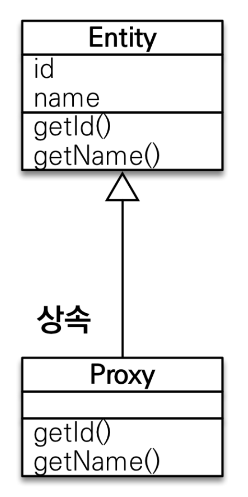

# CH08. 프록시와 연관관계 관리
## 8.1 프록시(대리인 : 대리인인 프록시를 통해 실제 객체에 접근한다.)
 - 특정 엔티티를 조회할 떄, 바로 사용할 것이 아니라면 연관된 엔티티까지 데이터베이스에서 함께 조회하는 것은 효율적이지 않다.</br> 
 그래서 JPA는 실제 사용하는 시점까지 연관된 엔티티의 데이터베이스 조회를 미루는(지연)하는 방법을 제공하는데,</br>이것을 '**지연 로딩**'이라고 한다.</br>
 이 지연 로딩 기능을 사용하려면 실제 엔티티 객체 대신에 데이터베이스 조회를 지연할 수 있는 가짜 객체가 필요한데,</br>이것을 **프록시 객체**라고 한다.
 - JPA 표준 명세는 지연 로딩의 구현방법을 JPA 구현체에 위임한다.</br>
 그래서 여기서 하이버네이트 구현체가 지연 로딩을 지원하기 위해 프록시를 사용하는 방법에 대해 알아보겠다.</br>
 (바이트코드를 수정하는 방법도 있는데, 설정이 복잡해서 여기서는 알아보지 않음)
  
### 8.1.1 프록시 기초
```java
    // 영속성 컨텍스트에서 식별자 "member1"로 조회할 수 있는 Entity가 없으면, DB 조회
    Member member = EntityManager.find(Member.class, "member1");

    // Entity를 실제 사용하는 시점까지 DB조회를 미룬다.
    // (호출 시점에 DB조회 x, 실제 Entity 객체 생성x)
    // DB접근을 위임한 프록시 객체를 반환
    Member proxyMember = EntityManager.getRefernce(Member.class, "member2");
```
▼ 프록시 구조</br>
- 실제 클래스를 상속 받아서 만들어졌다.
- 실제 클래스와 겉 모양이 같다.</br>

<br/>

▼ 프록시 위임</br>
- 프록시 객체는 실제 객체의 참조(target)를 보관한다.
- 프록시 객체의 메소드를 호출하면 프록시 객체는 실체 객체의 메소드 호출한다.</br>

<br/>

- 프록시 초기화 : Entity를 실제 사용하는 시점이 와서, 프록시 객체가 DB를 조회하여 실제 엔티티 객체를 생성하는 것

<br/>
```java
    // 프록시 클래스 예상 코드
    class MemberProxy extends Entity{
        Member target = null; // 실제 엔티티 참조

        public String getName(){
            if(target == null){
                // 초기화 요청
                // db 조회
                // 실제 엔티티 생성 및 참조 보관
                this.target = ...;
            }

            // *실제 Entity객체의 getName을 호출하여 결과 반환
            return target.getName();
        }
    }
```
- 특징 :
  - 프록시 객체는 처음 사용할 떄 한 번만 초기화된다.
  - 프록시 객체를 초기화할 때, 프록시 객체가 실제 엔티티로 바뀌는 것은 아님.</br>
  초기화되면 프록시 객체를 '통해서' 실제 엔티티에 접근 가능
  - 프록시 객체는 원본 엔티티를 상속받음, 따라서 타입 체크 시 주의해야 함</br>
  원본 엔티티와 비교시 instance of를 사용
  - em.getReference()를 호출시, 영속성 컨텍스트에 찾는 엔티티가 이미 있으면 실제 엔티티 반환
  - 준영속 상태의 프록시를 초기화하면 하이버네이트는 org.hibernate.LazyInitializationException 발생

### 8.1.2 프록시와 식별자
 - 프록시 객체는 식별자 값을 보관하기 때문에,</br> 
식별자 값을 조회하는 메서드를 호출하여도 프록시를 초기화하지 않는다. </br>
단, 엔티티 접근 방식이 @Access(AccessType.PROPERTY) 인 경우만</br>
@Access(AceessType.FILED)면 객체의 식별자 값 조회시, 프록시 객체를 초기화한다.
- 연관관계를 설정할 때에는 엔티티 접근 방식을 필드로 설정해도 프록시 초기화 x

```java
    Member member = em.find(Member.class, "member1");
    Team team = em.getRefernce(Team.class, "team1");
    // 연관관계 설정시 식별자 값만 사용하니까
    // 프록시를 사용하면 db접근 횟수를 줄일 수있다.
    member.setTeam(team); 
```

### 8.1.3 프록시 확인
 - PersistenceUtil.isLoaded(Object entity) : 
   - true : 이미 초기화 되었거나 프록시 인스턴스가 아닌 진짜 Entity 객체인 경우
   - false : 아직 초기화 되지 않은 프록시 인스턴스인 경우
 - 조회한 엔티티의 클래스명 출력해서 엔티티인지 프록시로 조회한 것인지 확인 가능 
 - hibernate initialize(객체) : 프록시 강제 초기화

## 8.2 즉시 로딩과 지연 로딩
- JPA는 연관된 엔티티의 조회 시점을 선택할 수 있도록 2가지 방법을 제공
  - 즉시 로딩 : @ManyToOne(fetch = fetchType.EAGER) - 열심인
  - 지연 로딩 : @ManyToOne(fetch = fetchType.LAZY) - 게으른
- 프록시 객체는 주로 연관된 연티티를 지연 로딩할 때 사용

### 8.2.1 즉시 로딩(EAGER LOADING)
 - @ManyToOne(fetch = fetchType.EAGER)
 - 연관된 객체를 함께 조회하는 것을 최적화 하기 위해, 가능하면 조인 쿼리를 사용
 - JPA는 연관 관계에 있는 객체와 선택적 관계면 OUTER JOIN, 필수적 관계면 INNER JOIN을 사용한다.
 - 외래키가 NULLABLE : OUTER JOIN, NOT NULL : INNER JOIN

```java
    @Entity
    public class Member{
        // 1. @ManyToOne(fetch = fetchType.EAGER, optional = false)
        // 2. 혹은 JoinColum의 nullabel 속성으로 jpa에게 nullalbe 여부를 알려준다.
        @ManyToOne(fetch = fetchType.EAGER)         
        @JoinColumn(name = "TEAM_ID", nullable = false) 
        private Team team;
    }
```

### 8.2.2 지연 로딩(LAZY LOADING)
 - @ManyToOne(fetch = fetchType.LAZY)
 - 조회 대상이 이미 영속성 컨텍스트에 있으면 프록시 객체 사용하지 않고 </br>
 프록시가 아닌 실제 객체를 사용한다.

### 8.2.3 정리
 - 지연 로딩 : 연관된 엔티티를 프록시로 조회한다.</br> 
 프록시를 실제 사용할 때 초기화하면서 데이터베이스를 조회한다. 
 - 즉시 로딩 : 연관된 엔티티를 즉시 조회한다.</br>
 하이버네이트는 가능하면 sql 조인을 사용해서 한 번에 조회한다.

## 8.3 지연 로딩 활용
### 8.3.1 프록시와 컬렉션 래퍼
- 컬렉션 래퍼 : hibernate는 엔티티를 영속상태로 만들 때<br/>
   엔티티에 컬렉션이 있으면 컬렉션을 추적하고 관리할 목적으로</br>
   원본 컬렉션을 hibernate가 제공하는 내장 컬렉션으로 변경한다.

```java
    Member member = em.find(Member.class, "member1");
    List <Order> orders = member.getOrders(); // 즉시 로딩이어도 여기서는 컬렉션 초기화 x
    Order order1 = member.getOrders().get(0); // 실제 데이터를 사용하는 여기서 컬렉션을 초기화한다.
    // orders → org.hibernate.collection.internal.PersistentBag
```

 -  컬렉션은 컬렉션 래퍼가 지연 로딩을 처리해준다.</br>
    → 컬렉션 래퍼도 컬렉션에 대한 프록시 역할을 하므로 따로 구분하지 않고 프록시라고 부름.

### 8.3.2 JPA 기본 fetch 전략
 - @ManyToOne @OneToOne : 즉시 로딩 - 하나 더 조회하는 것은 부담x
 - @OneToMany @ManyToMany : 지연 로딩 - 컬렉션을 더 조회하는 것은 부담o
 - 추천 : 개발start(all 지연로딩) → 개발완료단계(필요한 곳에만 즉시로딩 적용)

### 8.3.3 컬렉션에 FetchType.EAGER 사용시 주의점
 - 컬렉션을 하나 이상 즉시 로딩하는 것은 권장 x
 - 컬렉션 즉시 로딩은 항상 outer join</br>
 ex) 회원 N --(외래키 not null)-- 팀 1</br>
 1. 회원 테이블에서 팀 테이블로 다대일 관계 조인시 :</br> 
 모든 회원은 팀이 있으므로 내부조인 ok</br>
 2. 팀 테이블에서 회원 테이블로 일대다 관계 조인시 :</br> 
 회원이 없는 팀은 내부조인시 조회되지 않음 → 문제 발생</br>
 - 그래서 jpa는 일대다 관계 즉시 로딩시에는 항상 외부조인 사용
   - @ManyToOne @OneToOne : optional false inner join/optional true outer join
   - @OneToMany @ManyToMany : optional false/true all outer join... true도 outer인가?

## 8.4 영속성 전이 : CASCADE 
- 특정 엔티티를 영속 상태로 만들 때 연관된 엔티티도 함께 영속 상태로 만들고 싶을 때 사용
- 엔티티를 영속화할 때 연관된 엔티티도 함께 영속화하는 편리함을 제공할 뿐</br>
영속성 전이는 연관관계를 매핑하는 것과는 아무 관련이 없다.

### 8.4.1 저장 (cascade = cascadeType.PERSIST)
```java
    @Entity
    public class Parent{
        ...
        @OneToMany(mappedBy = "parent", cascade = cascadeType.PERSIST)
        private List<Child> children = new ArrayList<Child>();
        ...
    }

    private static void saveWithCascade(EntityManager em){
        Child child1 = new Child();
        Child child2 = new Child();

        Parent parent = new Parent();
        child1.setParent(parent); // 연관관계 추가
        child2.setParent(parent); // 연관관계 추가
        parent.getChildren().add(child1);
        parent.getChildren().add(child2);

        em.persist(parent); // 부모를 저장하면, 연관된 자식들도 저장
    }
```

### 8.4.2 삭제 (cascade = cascadeType.REMOVE)
```java    
    // 영속성 전이 삭제 설정 x    
        Parent parent = em.find(Parent.class, 1L);
        Child child1 = em.find(Child.class, 1L);
        Child child2 = em.find(Child.class, 2L);
        em.remove(child1);     
        em.remove(child2);     
        em.remove(parent);     
```

```java    
    // 영속성 전이 삭제 설정 o
        Parent parent = em.find(Parent.class, 1L);
        em.remove(parent); // 부모를 삭제하면, 연관된 자식들도 삭제    
```

### 8.4.3 CASCADE 종류
```java    
    public enum CascadeType {
        ALL, // 모두 적용
        PERSIST,
        MERGE, // 병합
        REMOVE,
        REFRESH,
        DETACH 
    }
```
- 여러 속성을 같이 사용 O
- PERSIST, REMOVE는 플러시 호출시 전이 발생

## 8.5 고아 객체 (orphanRemoval = true)
- 참조가 제거된 엔티티는 다른 곳에서 참조하지 않는 고애 객체로 보고 삭제하는 기능
- 따라서, 참조하는 곳이 하나일 때만 사용 → @OneToMany, @OneToOne
- 부모를 제거하면 자식이 고아가 되어 같이 제거되는데, 이것은 CascadeType.REMOVE와 같은 효과
```java
    @Entity
    public class Parent{
        ...
        @OneToMany(mappedBy = "parent", orphanRemoval = true)
        private List<Child> children = new ArrayList<Child>();
        ...
    }
```

## 8.6  영속성 전이 + 고아 객체, 생명주기
- Entity는 persist로 영속화되고, remove로 제거된다 →  Entity 스스로 생명주기 관리
- 그런데, cascadeType.ALL + orphanRemoval = true 으로 설정하면, </br>
부모 엔티티를 통해서 자식의 생명주기를 관리할 수 있다.
```java
    // 자식을 저장하려면, 부모에 등록만 하면됨
    Parent parent = em.find(Parent.class, parentId);
    parent.addChild(child);

    // 자식을 삭제하려면, 부모에서 제거만 하면됨
    Parent parent = em.find(Parent.class, parentId);
    parent.getChildren().remove(removeObject);
```