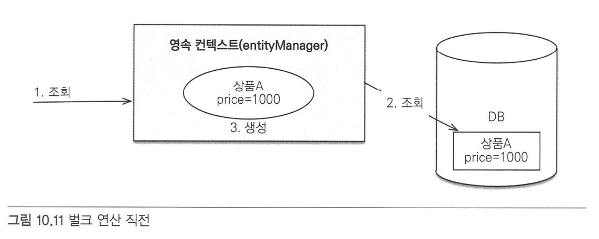
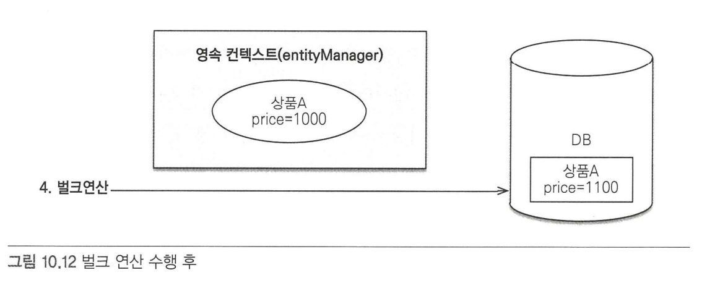
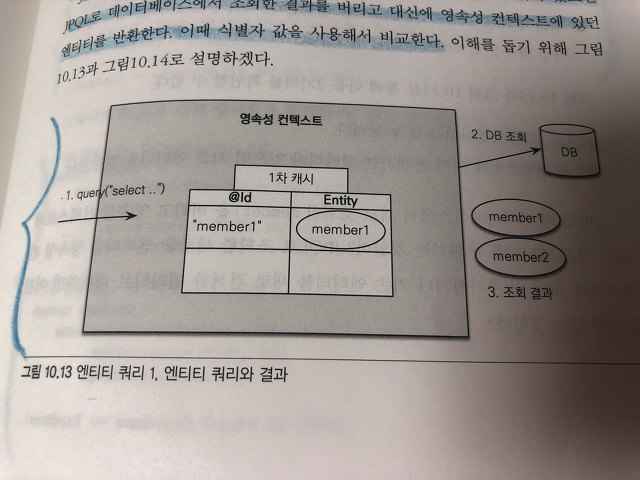
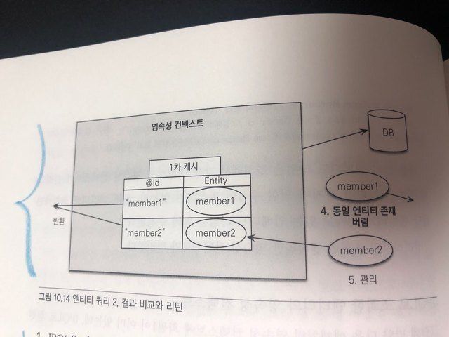

# CH10. 객체지향 쿼리 언어
## 10.2 JPQL
- 객체지향 쿼리 언어 - DB 테이블이 아니라 엔티티 객체를 대상으로 쿼리한다.
- SQL을 추상화하여 특정 DB에 의존하지 않는다.
- 결국 SQL로 변환된다.

### 10.2.1 기본문법과 쿼리API
 1. insert : EntityManager.persist() 사용으로 insert문은 없음
 2. select, update/delete(벌크연산) : 사용

- SELECT문
  - ` SELECT m FROM Member as m WHERE m.username = 'Hello' `
  - 엔티티와 속성은 대소문자 구문(JPQL 키워드는 구문 X)
  - JPQL의 FROM 절에는 테이블이 아니라 엔티티명이 사용된다.
    - @Entity(name = "생략하면 기본 클래스명")
  - 별칭 필수 : as는 생략가능

- TypeQuery, Query
  - 작성한 JPQL을 실행하려면 쿼리 객체 필요
  - 쿼리 객체는 TypeQuery, Query 2종류 있음
    - TypeQuery : 반환할 타입 명확하게 지정 가능한 경우
      - em.createQuery() 두번째 파라미터에 반환할 타입 지정 o
      - ex) `TypedQuery<Member> query = em.createQuery("SELECT m FROM Member m", Member.class)`
    - Query : 반환 타입을 명확하게 지정 불가한 경우
      - em.createQuery() 두번째 파라미터에 반환할 타입 지정 x
      - ex) `Query query = em.createQuery("SELECT m.username, m.age FROM Member m")`      
      - 조회 대상이 하나면 Object, 둘 이상이면 Object[] 반환 

- 결과 조회
  1. query.getResultList(); : 만약 결과가 없으면 빈 컬렉션 반환
  2. query.getSingleResult(); : 결과가 정확히 1개일 떄 사용(사용에 주의 필요)
     - 결과가 없으면 : javax.persistence.NoResultException
     - 결과가 2개 이상이면 : javax.persistence.NoUniqueResultException
     - `Member member = query.getSingleResult();`

### 10.2.2 파라미터 바인딩  
-  메서드 체이닝을 사용할 수 있다. 
-  이름 기반 바인딩 사용을 권장
  
  1. 이름 기반 바인딩
     - 이름 기준 파라미터는 앞에 :을 붙인다. =:
     - `TypedQuery<Member> query = em.createQuery("select m from Member m where m.username =: username", Member.class).setParameter("username", "user1");` 
 
  2. 위치 기반 바인딩
     - 위치 기준 파라미터는 위치값 앞에 ?를 붙인다. =? 
     - 위치값은 1부터 시작한다.
     - `TypedQuery<Member> query = em.createQuery("select m from Member m where m.username =? 1", Member.class).setParameter(1, usernameParam);` 

### 10.2.3 프로젝션
- select 절에 조회할 대상을 지정하는 것 : Entity, Embedded 타입, 스칼라 타입

1. Entity 프로젝션이란?
   - 객체를 조회하는 Select문을 말한다.
      - `select m from Member m`
      - `select m.team from Member m`
   - 반환 타입이 명확(조회하는 객체)하니까, TypedQuery 사용가능
   - 조회 결과인 Entity는 영속성 컨텍스트에서 관리한다.
    
2. Embedded 타입 프로젝션
   - Embedded Type 을 조회
   - 제약 : FROM 절에 올수 없다. → `select a from Address a` (x)</br>Entity를 통해서만 Embedded Type 조회 가능 → `select o.address from Order o` (o)
   - 반환 타입이 명확(조회하는 값 타입)하니까, TypedQuery 사용가능
   - 조회 결과는 영속성 컨텍스트에서 관리하지 않는다. 
 
3. 스칼라 타입 프로젝션 
    - 숫자, 문자, 날짜와 같은 기본 데이터 타입 조회
    - 중복 데이터를 제거하려면 distinct 사용
    - `em.createQuery("select m.name from Member m", String.class);`

4. 여러 값 조회
    - 여러 값을 선택하면 TypeQuery 사용 불가, Query 사용
    - 이때 엔티티를 조회한다면, 엔티티는 영속성 컨텍스트에서 관리
    
        ```
            Query query = em.createQuery("select m.username, m.age, m.team from Member m");
            List resultList = query.getResultList();

            Iterator iterator = resultList.iterator();
            
            while(iterator.hasNext()){
                Object[] now = (Object[])iterator.next();
                String username = (String) now[0];
                Integer age = (Integer) now[1]; // 스칼라
                Team team = (Team) now[2]; // 엔티티
            }

        ```

    - 좀 더 간결하게 쓰기 위해서 아래와 같이 제네릭에 Object[]를 사용하기도 하는데

        ```
            Query query = em.createQuery("select m.username, m.age, m.team from Member m");
            List<Object[]> resultList = query.getResultList();
            
            for(Object[] row: resultList){
                String username = (String) row[0];
                Integer age = (Integer) row[1]; // 스칼라
                Team team = (Team) row[2]; // 엔티티
            }

        ```

5. New 명령어  
    - select 다음에 new 명령어 사용하면, 반환받을 클래스 지정 가능(패키지 명 포함한 전체 클래스명 입력)
    - 해당 클래스의 생성자에 jpql 조회결과를 넘겨줄 수있다.(순서, 타입 일치하는 생성자 셋팅은 필요)
    - 해당 클래스로 TypeQuery 사용가능! 

        ```
            TypedQuery<UserDTO> query = em.createQuery("select new jpabook.jpql.UserDTO(m.username, m.age) from Member m", UserDTO.class);
            
            List<UserDTO> resultList = query.getResultList();

        ```

### 10.2.4 페이징API
- JPA는 페이징을 2가지 API로 추상화했다.
- 페이징 API는 설정한 DB방언에 따라 그에 맞는 페이징 쿼리로 변환된다. 

1) 조회 시작 위치 : setFirstResult(int startPosition)
   - 0부터 시작
2) 조회할 데이터 수 : setMaxResults(int maxResult)

    ```
        List<Member> result = 
                em.createQuery("select m from Member m order by m.username desc", Member.class)
                .setFirstResult(10)
                .setMaxResults(20)
                .getResultList();
    ```

### 10.2.5 집합과 정렬
 - 집합함수  
    |함수|설명|
    |------|---|
    |COUNT|반환타입 : Long|
    |MAX, MIN|최대, 최소값. 문자,숫자,날짜 등에 사용|
    |AVG|평균. 숫자타입만. 반환타입 : Double|
    |SUM|합. 숫자타입만. 반환타입 : 정수합 Long, 소수합 Double|
   - NULL은 무시 → 통계에 잡히지 않음(DISTINCT되어 있어도 무시됨)
   - DISTINCT를 집합 함수안에 사용하여 중복제거 후 집합 구할 수 있음
     - ex) `select count(distinct m.age) from Member m`
   - distinct 를 count에서 사용할 떄, 임베디드 타입은 지원x
 - GROUP BY, HAVING
    ```
      select t.name, count(m.age), sum(m.age), avg(m.age), max(m.age), min(m.age)
      from Member m left join m.team t
      group by t.name
      having avg(m.age) >= 10
    ```
 - ORDER BY
  
### 10.2.6 JPQL 조인
  - 내부 조인 - [INNER] JOIN
    - 연관 필드 : 다른 엔티티와 연관관계를 가지기 위해 사용하는 필드 (m.team)
    - JPQL은 JOIN 명령어 다음에 조인할 객체의 연관 필드를 사용
    - `SELECT m FROM Member m INNER JOIN m.team t WHERE t.name = :teamName` (O)
    - `SELECT m FROM Member m JOIN Team t` (X)
  - 외부 조인 - LEFT [OUTER] JOIN
    - `SELECT m FROM Member m LEFT [OUTER] JOIN m.team t`
  - 컬렉션 조인
    - 일대다 관계나 다대다 관계처럼 컬렉션을 사용하는 곳에 조인하는 것
    - `SELECT m, t FROM Team t LEFT JOIN t.members m` ← Team 엔티티의 members 컬렉션값 연관 필드로 외부 조인
  - 세타 조인
    - where 절 사용하여 세타조인
    - 내부조인만 지원
    - 세타조인으로 전혀 관계 없는 엔티티도 조인 가능
    - JPQL : `select count(m) from Member m, Team t where m.username = t.name`
    - SQL  : `SELECT COUNT(M.ID) FROM MEMBER M CROSS JOIN TEAM T WHERE M.USERNAME = T.NAME`
  - JOIN ON 절 (JPA 2.1 부터 지원)
    - ON 절을 사용하여 JOIN 대상을 필터링
    - 내부 조인의 ON 절은 WHERE절을 사용할 때와 결과가 같기 때문에 </br>
    보통 ON절은 외부조인에서만 사용
    - `SELECT m, t FROM Member m LEFT JOIN m.team t ON t.name = 'A'`

### 10.2.7 페치 조인(fetch join)
  - 일반적인 SQL의 join 개념 x, JPQL에서 성능 최적화를 위해 제공하는 기능
  - 연관된 Entity나 Collection을 한번에 같이 조회하는 기능
  - JPQL 내부/외부 조인 뒤에 fetch만 붙이면 됨
  - fetch join 하는 Entity에는 별칭을 사용할 수 없음(hibernate는 별칭 허용)
  1. Entity Fetch Join (?:1의 관계일 때)
     - `select m from Member m join fetch m.team`
     - `SELECT M.*, T.* FROM MEMBER M INNER JOIN TEAM T ON M.TEAM_ID = T.ID`
     - 회원을 조회할 때, 회원 엔티티 내에 연관관계를 맺고 있는 team도 함께 조회한다.
  2. Collection Fetch Join (?:N의 관계일 때)
     - `select t from Team t join fetch t.members where t.name = '팀A'`
     - `SELECT T.*, M.* FROM TEAM T INNER JOIN MEMBER M ON T.ID = M.TEAM_ID WHERE T.NAME = '팀A'`
  3. Fetch Join 과 DISTINCT
     - JPQL의 DISTINCT는 SQL에 DISTINCT 추가 + APP에서 한번 더 중복 제거 
  4. Fetch Join 과 일반 JOIN
     - 일반 join쓰면서 select절에 연관관계가 있는 엔티티는 조회하지 않으면,</br>
     연관관계가 있는 엔티티는 조회되지 않는다.
     - JPQL은 결과를 반환할 때, 연관관계까지 고려하지 않는다. </br>
     단지, SELECT 절에 지정한 엔티티만 조회할 뿐이다.
     - 연관관계 엔티티와 지연로딩 설정해두었다면, 이후 조회시에 프록시나 초기화되지 않은 컬렉션 래퍼 반환. 
     - 연관관계 엔티티와 즉시로딩 설정해두었다면, 쿼리를 한 번 더 실행 
  5. Fetch Join의 특징
     - Fetch Join을 사용하면, SQL 한번으로 연관된 엔티티들을 함께 조인할 수 있어,</br>
     SQL 호출 횟수를 줄이고 성능을 최적화할 수 있다.
     - Fetch join > 엔티티에 직접 적용한 로딩 전략(글로벌 로딩 전략)
       - ex) Fetch Join vs 글로벌 로딩전략(지연로딩) ==> Fetch Join 승   
     - [글로벌 로딩 전략 : 지연로딩] + Fetch Join 권장
     - Fetch Join 사용 -> 준영속상태에서도 객체 그래프 탐색 가능 
  6. Fetch Join의 한계
     - 별칭 x → select, where, 서브쿼리에 fetch join 대상 사용 x
     - 둘 이상의 컬렉션을 fetch할 수 없다.
     - 컬렉션을 Fetch Join하면 페이징 API 사용 불가
   
### 10.2.8 경로표현식
 - 경로표현식 : .(점)을 찍어 객체 그래프를 탐색하는 것
 - 상태 필드 : 단순히 값을 저장하기 위한 필드 → 더 이상 탐색 x
 - 연관 필드 : 연관관계를 위한 필드/묵시적 내부 조인 발생
   - 단일 값 연관 필드(@~ToOne) → 탐색 o
   - 컬렉션 값 연관 필드(@~ToMany) → 탐색 x
   - 단, 컬렉션 값 연관 필드도 FROM절에서 명시적 조인을 통해 별칭을 얻으면, 별칭을 통해 탐색 가능
   - 컬렉션은 컬렉션 크기를 구할 수 있는 size 사용 가능 `select t.members.size from Team t`
 - 되도록이면 명시적 조인을 사용하자

### 10.2.9 서브 쿼리
 - JPQL도 SQL처럼 서브쿼리를 지원하지만, JPA표준에서는 WHERE, HAVING 절에만 사용가능
 - hibernate 구현에서는 SELECT도 가능
 - FROM 절의 서브쿼리는 JPQL에서 불가
 - 서브쿼리 지원함수

  |함수|내용|
  |------|---------------|
  |[NOT] EXISTS|서브쿼리에 결과가 존재하면 참(NOT은 반대)|
  |ALL / ANY / SOME|비교 연산자와 같이 사용</br>- ALL : 조건을 모두 만족하면 참</br>- ANY / SOME : 조건을 하나라도 만족하면 참</br>`select m from Member m`</br>`where m.team = ANY(select t from Team t)`|
  |[NOT] IN |서브쿼리의 결과 중 하나라도 같은 것이 있으면 참.</br>참고로 in은 서브쿼리가 아닌 곳에서도 사용|`select t from Team t`</br>`where t in (select t2 from Team t2 join t2.)`|

### 10.2.10 조건식
 - 타입 표현 / 대소문자 구분 X

  |종류|설명|예제|
  |------|---------------|----|
  |문자|작은 따옴표 사이에 표현</br>작은 따옴표 표현시에는 두개('') 사용|'HELLO'</br>'She''s'|
  |숫자|L(Long 타입)</br>D(Double 타입)</br>F(Float 타입)|10L</br>10D</br>10F|
  |날짜|DATE {d 'yyyy-mm-dd'}</br>TIME {t 'hh-mm-ss'}</br>DATETIME {ts 'yyyy-mm-dd hh:mm:ss.f'}|{d '2023-12-29'}</br>{t '09-26-10'}</br>{ts '2023-12-29 09-26-10.123'}|
  |Boolean|TRUE, FALSE||
  |Enum|패키지명을 포함한 전체 이름을 사용|jpabook.MemberType.Admin|
  |엔티티 타입|엔티티의 타입을 표현.</br>주로 상속과 관련하여 사용|TYPE(m) = Member|

 - 연산자 우선 순위
   1. 경로 탐색 연산 : .
   2. 수학 연산 : +(단항 연산), -(단항 연산), *, /, +, -
   3. 비교 연산 : =, >, >=, <, <=, <>,</br>
    [NOT] BETWEEN, [NOT] LIKE, [NOT] IN ,</br>
    IS [NOT] NULL, [NOT] EXISTS, </br>
    [NOT] MEMBER [OF], IS [NOT] EMPTY
   4. 논리연산 : NOT, AND, OR

IS [NOT] EMPTY, [NOT] MEMBER [OF] 만 뺴면 사용법은 일반적인 SQL과 동일하다.이 두개는 컬렉션 식으로써 JPA에서 제공하는, 컬렉션에만 사용가능환 특별 기능이다.
컬렉션 식
컬렉션에만 사용될 수 있음에 주의해야 한다. 컬렉션이 아닌 곳에 사용하면 오류가 발생한다.


 - 컬렉션 식
   - 컬렉션에만 사용될 수 있음
    1. IS [NOT] EMPTY / 빈 컬렉션 비교식
         - 문법 : {컬렉션 값 연관 경로} IS [NOT] EMPTY
         - 설명 : 컬렉션에 값이 비었으면 참
      ```
        // JPQL
        SELECT m
        FROM Member m
        WHERE m.orders IS EMPTY // null과 비교시 오류! 

        // SQL
        SELECT m.*
        FROM Member m
        WHERE EXISTS (
            SELECT o.id
            FROM Order_ o
            WHERE o.member_id = m.id
        )
      ```
    2. [NOT] MEMBER [OF] / 컬렉션 멤버 식
          - 문법 : {엔티티나 값} [NOT] MEMBER [OF] {컬렉션 값 연관경로}
          - 설명 : 엔티티나 값이 컬렉션에 포함되어 있으면 참
      ```
        // JPQL
        // 전달된 멤버가 포함되어 있는 팀 조회  
        SELECT t
        FROM Team t
        WHERE :memberParam MEMBER OF t.members
      ```

 - 스칼라 식</br>
  → 숫자, 문자, 날짜, case, 엔티티 타입 같은 가장 기본적인 타입들을 스칼라 타입</br>
  → 스칼라 타입에 사용하는 식

    1. 문자함수

        |함수|설명|예제|
        |--|--|--|
        |CONCAT(문자1, 문자2)|문자를 합한다|CONCAT(‘A’, ‘B’) = AB|
        |SUBSTRING(문자, 위치[, 길이])|위치부터 시작해 길이만큼 문자를 구한다. 길이 값이 없으면 나머지 전체 길이를 뜻한다.|SUBSTRING(‘ABCDEF’, 2, 3) = BCD|
        |TRIM([[LEADING/ TRAILING/ BOTH] [트림 문자] FROM] 문자)|LEADING(왼)/TRAILING(오)/BOTH(양쪽-default)<br/>트림문자의 기본값은 공백|TRIM(' ABC ') = 'ABC'|
        |LOWER(문자)|소문자로 변경|LOWER(‘ABC’) = abc|
        |UPPER(문자)|대문자로 변경|UPPER(‘abc’) = ABC|
        |LENGTH(문자)|문자 길이|LENGTH(‘ABC’) = 3|
        |LOCATE(찾을 문자, 원본 문자[,검색 시작 위치])|검색위치부터 문자를 검색한다. 1부터 시작하고 못찾으면 0을 반환한다.|LOCATE(‘DE’, ‘ABCDEFG’) = 4|
    2. 수학함수
        |함수|설명|예제|
        |--|--|--|
        |ABS(식수학식)|절대값을 구한다|ABS(-10) = 10|
        |SQRT(수학식)|제곱근을 구한다|SQRT(4) = 2.0|
        |MOD(수학식, 나눌 수)|나머지를 구한다|MOD(4, 3) = 1|
        |SIZE(컬렉션 값 연관 경로식)|컬렉션의 크기를 구한다|SIZE(t.members)|
        |INDEX(별칭)|LIST 타입 컬렉션의 위치값을 구함.</br>단 컬렉션이 @OrderColumn을 사용하는 LIST 타입일 때만 사용할 수 있다|t.members m where INDEX(m) > 3|

    3. 날짜함수 : 데이터베이스의 현재 시간을 조회
        |함수|설명|
        |--|--|
        |CURRENT_DATE|현재 날짜|
        |CURRENT_TIME|현재 시간|
        |CURRENT_TIMESTAMP|현재 날짜 시간|
        - 하이버네이트는 날짜 타입에서 년,월,일,시,분,초 값을 구하는 기능을 지원</br>
        (YEAR,MONTH,DAY,HOUR,MINUTE,SECOND)
        - `SELECT YEAR(m.createdDate), MONTH(m.createdDate), DAY(m.createdDate) FROM Member;`

 - CASE 식
  1. 기본 CASE
     - 문법 :
      ```
        CASE  
            {WHEN <조건식> THEN <스칼라식>}+  
            ELSE <스칼라식>  
        END
      ```

  2. 심플 CASE
     - 문법 :
      ```
        CASE <조건대상>  
            {WHEN <스칼라식1> THEN <스칼라식2>}+
            ELSE <스칼라식>
        END
      ```

  3. COALESCE
     - 문법 : COALESCE(<스칼라식>, {,<스칼라식>}+)
     - 설명 : 스칼라식을 차례대로 조회해서 null이 아니면 반환한다.
      ```
        SELECT COALESCE(m.usernae, '이름없는회원') 
        FROM Member m
        // m.username이 null이면 '이름없는회원'을 반환
      ```

  4. NULLIF
     - 문법 : NULLIF(<스칼라식>, <스칼라식>)
     - 설명 : 두 값이 같으면 null 반환, 다르면 첫번째 값을 반환한다.

### 10.2.11 다형성 쿼리
 - JPA에서 상속관계로 매핑된 엔티티가 있을 때, </br>
  부모 엔티티를 조회하면 그 자식 엔티티도 함께 조회
 - 아래 JPQL을 수행하였을 때, 상속매칭 SINGLE_TABLE, JOINED의 경우 각각 수행되는 쿼리</br>
  `List resultList = em.createQuery("select i from Item i").getResultList();` 
    - InheritanceType.SINGLE_TABLE : </br>
    `select * from item`
    - InheritanceType.JOINED : </br>
        ``` 
          select 
            i.item_id, i.dtype, i.name, i.price, i.stockQuantity,
            b.author, b.isbn,
            a.artist, a.etc,
            m.actior, m.director
          from Item i
          left outer join
            Book b  on i.item_id = b.item.id 
          left outer join 
            Album a on i.item_id = a.item.id
          left outer join 
            Movie m on i.item_id = m.item.id
        ```
  - TYPE : 특정 자식 타입만 조회할 떄 주로 사용
    - JPQL : `select i   from Item i where type(i) in (Book, Movie)`
    - SQL  : `select i.* from item i where dtype in ('B', 'M')`
    - Item 엔티티에서 @DiscriminatorColumn 로 지정한 ITEM_TYPE 컬럼에 </br>
      Book, Movie 엔티티에서 지정한 @DiscriminatorValue 값인 B, M으로 조회

  - TREAT (JPA 2.1 부터)
    - 부모 타입을 특정 자식 타입으로 다룰 떄 사용
    - JPQL : `select i   from Item i where treat(i as Book).author = 'kim'`
      - 부모타입인 Item 을 자식 타입인 Book로 다우러 author 필드에 접근 가능
    - SQL  : `select i.* from Item i where i.dtype = 'B' and i.author = 'kim'`
  
### 10.2.12 사용자 정리 함수 호출(JPA 2.1부터)
|||
|------|---------------|
|문법|FUNCTION(function_name {, function_arg}*)|
|예|`SELECT FUNCTION('group_concat', i.name) FROM Item i`|

 - hibernate 구현체를 사용하면, 방언 클래스를 상속해서 사용자 정의하여 사용할 데이터베이스 함수를 미리 등록해야 한다.
    ```
      public class MyH2Dialect extends H2Dialect{
          public MyH2Dialect(){
              registerFunction("group_concat", new StandardFunction
                ("group_concat", StandardBasicTypes.STRING));
          }
      }
    ```

 - 상속한 Dialect는 아래와 같이 등록
    - `<property name="hibernate.dialect" value="com.joont.dialect.MyH2Dialect" />`
 - 하이버네이트를 사용하면 기본 문법보다 축약해서 사용할 수 있다.
   - `SELECT group_concat(i.name) FROM Item i`

### 10.2.13 기타 정리
  1. enum은 = 비교연산만 지원, 임베디드 타입은 비교 지원x
  2. Empty String : 
    </br>JPA는 ''을 길이 0인 Empty String으로 정의함
    </br>DB에 따라 ''를 null로 사용하는 db가 있으니 확인하고 사용필요
  3. NULL 정의
    </br>- 조건을 만족하는 데이터가 하나도 없으면 NULL
    </br>- NULL은 알수 없는 값이다. NULL과의 모든 수학적 연산은 NULL
    </br>- 논리연산 and : NULL AND False → False
    </br>- 논리연산 or  : NULL OR  True  → True
    
### 10.2.14 엔티티 직접 사용
 - 객체 인스턴스는 참조 값으로 식별, 테이블 로우는 기본 키 값으로 식별</br>
  → JPQL에서 엔티티 객체를 직접 사용하면 SQL에서는 해당 엔티티의 기본 키 값을 사용한다.

 1. 기본 키 예제
    - JPQL : `SELECT COUNT(m) FROM Member m`</br>
     → SQL : `SELECT COUNT(m.id) FROM Member m`
    - JPQL : 
      ```java
        List<Member> result = 
            em.createQuery("SELECT m FROM Member m WHERE m = :member")
            .setParameter("member", member) // 엔티티 객체 직접 사용
            .getResultList();
      ```
      → SQL :  `SELECT m.* FROM Member m WHERE m.id = ? ` < 파라미터 member의 id 값

 2. 외래키 예제
    - JPQL : 
      ```java
        List<Member> result = 
            em.createQuery("SELECT m FROM Member m WHERE m.team = :team")
            .setParameter("team", team) // 엔티티 객체 직접 사용
            .getResultList(); 
      ```
      → SQL : `SELECT m.* FROM Member m WHERE m.team_id = ?` < 파라미터 team의 id 값

### 10.2.15 Named 쿼리 : 정적 쿼리
 - 동적 쿼리 : em.createQuery("select ... ") 처럼 JPQL을 문자로 완성해서 직접 넘기는 것
 - 정적 쿼리(Named 쿼리) : 미리 정의한 쿼리에 이름을 부여해서 필요할 때 사용하는 것 
   - 장점 : 어플리케이션 로딩 시점에 JPQL 문법을 체크하고 미리 파싱해둠
   </br>→ 오류를 빨리 확인할 수 있고, 사용하는 시점에는 파싱된 결과를 재사용하므로 성능상 이점

 1. 어노테이션에 정의 ( @NamedQuery )
    - 여러개 @NamedQueries, 한개 @NamedQuery 어노테이션으로 정의
    - name의 엔티티 이름 : 정적 쿼리는 영속성 유닛 단위로 관리되므로 충돌방지를 위해 부여

      ```java
        @Entity
        @NamedQuery(
            name = "Member.findByUsername",
            query = "SELECT m FROM Member WHERE m.username = :username")
        class Member{ // ...
        }
      ```
      ```java
        // 사용 예
        List<Member> resultList = 
            em.createNamedQuery("Member.findByName", Member.class)
            .setParameter("username", "회원1")
            .getResultList();
      ```

 2. XML에 정의
      - 자바로 멀티라인 문자를 다루는 것은 상당히 귀찮기 때문에</br>
     Named 쿼리를 작성할 때는 XML을 사용하는 것이 더 편리하다.
      - XML에서 &, <, >,는 예약문자어라서, 대신 &amp;, &lt;, &gt;를 사용해야 한다.
      </br> <![ CDATA[ ]]>를 사용하면 그 사이에 있는 문자를 그대로 출력하므로 예약 문자도 사용할 수 있다.
      - xml과 어노테이션에 같은 이름의 Named 쿼리 존재하는 경우 > xml 우선
  
    ```xml
      <!-- META-INF/ormMember.xml 생성 및 named query 정의 -->
      <xml version="1.0" encoding="UTF-8"?>
      <entity-mappings xmlns="http://xmlns.jcp.org/xml/ns/persistence/orm" version="2.1">
          <named-query name="Member.findByUserName">
              <query><![CDATA[
                  select m 
                  from Member m 
                  where m.username = :username
              ]]></query>
          </named-query>

          <named-query name="Member.count">
              <query>
                  select count(m) 
                  from Member m 
              </query>
          </named-query>

      </entity-mappings>
    ```
    ```xml
      <!-- META-INF/persistence.xml에 ormMember.xml 인식하도록 코드 추가 -->
      <persistence-unit name="jpabook">
        <mapping-file>META-INF/ormMember.xml</mapping-file>
    ```

## 10.4. QueryDSL
### 10.4.1 QueryDSL 설정
 - 필요한 라이브러리 2개를 pom.xml에 추가
    ```xml
      <!-- QueryDSL JPA 라이브러리 -->
      <dependency>
          <groupId>com.mysema.querydsl</groupId>
          <artifactId>querydsl-jpa</artifactId>
          <version>${querydsl.version}</version>
      </dependency>

      <!-- 쿼리 타입(Q)을 생성할 때 필요한 QueryDSL APT 라이브러리 -->
      <dependency>
          <groupId>com.mysema.querydsl</groupId>
          <artifactId>querydsl-apt</artifactId>
          <version>${querydsl.version}</version>
          <scope>provided</scope>
      </dependency>
    ```

 - 환경설정
    - QueryDSL을 사용하려면, 엔티티를 기반으로 '쿼리 타입'이라는 쿼리용 클래스를 생성해야 한다.
    - 쿼리 타입(쿼리용 클래스)를 컴파일시에 자동으로 생성해주는 플러그인을 pom.xml에 추가
    ```xml
      <build>
        <plugins>
          <plugin>
              <groupId>com.mysema.maven</groupId>
              <artifactId>apt-maven-plugin</artifactId>
              <version>1.1.3</version>
              <executions>
                  <execution>
                      <goals>
                          <goal>process</goal>
                      </goals>
                      <configuration>
                          <outputDirectory>target/generated-sources/java</outputDirectory>
                          <processor>com.mysema.query.apt.jpa.JPAAnnotationProcessor</processor>
                      </configuration>
                  </execution>
              </executions>
          </plugin>
        </plugins>
      </build>
    ```
    - 콘솔에서 mvn compile 혹은 인텔리제이에서 maven lifecycle -> compile을 실행하면</br>
    outputDirectory에 지정한 위치에 Q로 시작하는 쿼리용 클래스가 생성됨
    - Q Class가 생성된 디렉토리(target/generated-sources)를 소스 경로로 추가한다.</br>
    (인텔리제이 기준 File - Project Structure - Modules 메뉴 사용)

### 10.4.2 시작
  ```java
    public void queryDSL() {
        EntityManager em = emf.createEntityManager();
        
        // 1. 우선 com.mysema.query.jpa.impl.JPAQuery 객체 생성
        JPAQuery query = new JPAQuery(em); // EntityManager 생성자에 넘겨줌

        // 2. 사용할 쿼리 타입 생성
        QMember qMember = new QMember("m"); // 생성자에 별칭을 준다(m)

        List<Member> members = query.from(qMember)
                 .where(qMember.name.eq("회원1"))
                 .orderBy(qMember.name.desc())
                 .list(qMember);
     }
  ```
  - 기본 Q 생성
    - 쿼리 타입(Q)은 사용하기 편리하도록 기본 인스턴스를 보관하고 있다.
    - 같은 엔티티를 조인하거나 같은 엔티티를 서브쿼리에 사용하면</br>
    같은 별칭이 사용되므로 이때는 별칭을 직접 지정하여 사용한다.
  ```java
    public class QMember extends EntityPathBase<Member>{
      public static final QMember member = new QMember("member1"); // 기본 인스턴스
    }
  ```  
  ```java
    // 쿼리 타입 사용 2가지 방법
    QMember qMember = new QMember("m"); // 1. 별칭 직접 지정
    QMember qMember = QMember.member; // 2. 기본 인스턴스 사용
  ```
  ```java
    // 쿼리 타입의 기본 인스턴스를 사용하는 예제
    import static jpabook.jpashop.domain.QMember.member; // 1.기본 인스턴스 import

    public void basic() {
        EntityManager em = emf.createEntityManager();
        JPAQuery query = new JPAQuery(em); 

        // 2. import한 기본 인스턴스 사용 > 코드를 간결하게 작성 가능
        List<Member> members = query.from(member)
                 .where(member.name.eq("회원1"))
                 .orderBy(member.name.desc())
                 .list(member);
     }
  ```
### 10.4.3 검색조건 쿼리
  ```java
    JPAQuery query = new JPAQuery(em);
    QItem item = QItem.item;

    // 쿼리 타입의 필드가 필요한 대부분의 메서드를 명시적으로 제공
    List<Item> list = query.from(item)
        .where(item.name.eq("좋은 상품")).and(item.price.gt(1000))
        .list(item); // 결과 조회 메서드에 조회할 프로젝션 지정
  ```
### 10.4.4 결과조회 메서드
 - 결과조회 메서드를 호출하면, 실제 데이터 베이스를 조회
 - 결과 조회 API는 com.mysema.query.Projectable에 정의
  1. uniqueResult() : 조회 결과 1 건일 때 사용.
  <br/>조회 결과 없으면 null, 2 이상이면 NonUniqueResultException 예외 발생
  2. singleResult() : uniqueResult와 같은데,
  <br/>조회 결과 2 이상이면, 처음 데이터를 반환
  3. list() : 결과가 하나 이상일 때 사용. 결과가 없으면 빈 컬렉션 반환
 
### 10.4.5 페이징과 정렬
  ```java
    // 1. 정렬 : orderBy와 쿼리 타입이 제공하는 asc(). desc() 사용
    // 2. 페이징 : offset과 limit 사용    
    query.from(item)
        .where(item.price.gt(1000))
        .orderBy(item.price.desc(), item.stockQuantity.asc())
        .offset(10).limit(20)
        .list(item);
  ```
  ```java
    // 3. 페이징 : restrict 메소드에 QueryModifers를 파라미터로 넘겨도 됨
    QueryModifiers queryModifiers = new QueryModifiers(20L, 10L); // limit, offset
    List<Item> list = query.from(item)
                            .restrict(queryModifiers)
                            .list(item);
  ```
### 10.4.6 그룹
  ```java
    // groupBy, having 사용
    query.from(item)
        .groupBy(item.price)
        .having(item.price.gt(1000))
        .list(item);
  ```
### 10.4.7 조인
 - join(innerJoin), leftJoin, rightJoin, fullJoin
    ```java
      QOrder order = QOrder.order;
      QMember member = QMember.member;
      QOrderItem orderItem = QOrderItem.orderItem;
      // join(조인대상, 별칭으로 사용할 쿼리타입)
      query.from(order)
          .join(order.member, member)
          .leftJoin(order.orderItems, orderItem)
          .on(orderItem.count.gt(2))
          .list(order);
    ```
- fetch 조인
    ```java
      query.from(order)
          .innerJoin(order.member, member).fetch()
          .leftJoin(order.orderItems, orderItem).fetch()
          .list(order);
    ```
- 세타조인
    ```java
      // 세타조인
      QOrder order = QOrder.order;
      QMember member = QMember.member;

      query.from(order, member)
          .where(order.member.eq(member))
          .list(order);
    ```
### 10.4.8 서브쿼리
  - com.mysema.query.jpa.JPASubQuery 생성하여 사용
  - 서브쿼리 결과가 하나면 unique(), 여러건이면 list()로 결과 조회
  
    ```java
      QItem item = QItem.item;
      QItem itemSub = new QItem("itemSub");

      query.from(item)
            .where(item.price.eq(
              new JPASubQuery().from(itemSub).unique(itemSub.price.max())
            ))
            .list(item);
    ```
### 10.4.9 프로젝션과 결과 반환
 - 프로젝션 : select 절에 조회 대상을 지정하는 것
 1. 프로젝션 대상이 하나
  ```java
    QItem item = QItem.item;
    // item의 name만 select, name이 String이니까 해당 타입으로 반환
    List<String> result = query.from(item).list(item.name); 

    for(String name : result){
      System.out.println("name : " + name);
    }
  ```
 2. 여러 컬럼 반환과 튜플
  ```java
    QItem item = QItem.item;
    // item의 name, price 여러 필드 select
    // Tuple이라는 Map과 비슷한 내부 타입을 사용
    List<Tuple> result = query.from(item).list(item.name, item.price); 
    //List<Tuple> result = query.from(item).list(new QTuple(item.name, item.price)); 

    for(Tuple tuple : result){
      System.out.println("name : " + tuple.get(item.name)); // tupe.get() 메소드에 조회한 쿼리타입 지정하여 조회
      System.out.println("price : " + tuple.get(item.price));
    }
  ```
 3. 빈 생성
  - 쿼리 결과를 엔티티가 아닌 특정 객체로 받고 싶으면, 빈 생성 기능 사용
  - QueryDSL이 제공하는 객체 생성 방법
    - 프로퍼티 접근
    - 필드 직접 접근
    - 생성자 사용
  - distinct : `query.distinct().from(item)...`
  ```java
    public class ItemDTO{
      private String username;
      private int price;

      public ItemDTO()

      public ItemDTO(String username, int price){
        this.username = username;
        this.price    = price;
      } 

      // Getter, Setter
      public String getusername(){...}
      public void setusername(String username){...}
      public int getPrice(){...}
      public void setPrice(int price){...}
    }    
  ```
  ```java
    // 1. 프로퍼티 접근
    QItem item = QItem.item;
    // Projections.bean() 메소드는 setter를 사용해서 값을 채운다.
    List<ItemDTO> result = query.from(item).list(
      Projections.bean(ItemDTO.class, item.name.as("username"), item.price));
    // 쿼리 결과와 매핑할 프로퍼티 이름이 다르면 as를 사용해서 별칭을 주면된다.

    // 2. 필드 직접 접근
    // fields : 필드에 직접 접근하여 값을 채운다. 필드가 private여도 동작함
    List<ItemDTO> result = query.from(item).list(
      Projections.fields(ItemDTO.class, item.name.as("username"), item.price));

    // 3. 생성자 사용 Projections
    List<ItemDTO> result = query.from(item).list(
      Projections.constructor(ItemDTO.class, item.name, item.price));
  ```
### 10.4.10 수정, 삭제 배치 쿼리
 - QueryDSL도 수정, 삭제 같은 배치쿼리를 지원한다. 
 - JPQL 배치쿼리와 같이 영속성 컨텍스트를 무시하고 데이터베이스에 직접 쿼리를 수행한다.
```java
  QItem item = QItem.item;
  // 수정 배치 쿼리
  JPAUpdateClause updateClause = new JPAUpdateClause(em, item);
  long count = updateClause.where(item.name.eq("시골 개발자의 JPA책"))
                            .set(item.price, item.price.add(100))
                            .execute();
```
```java
  QItem item = QItem.item;
  // 삭제 배치 쿼리
  JPADeleteClause deleteClause = new JPADeleteClause(em, item);
  long count = deleteClause.where(item.name.eq("시골 개발자의 JPA책"))
                            .execute();
```
### 10.4.11 동적 쿼리
 - BooleanBuilder로 특정 조건에 따른 동적 쿼리를 쉽게 생성할 수 있음
  ```java
    SearchParam param = new SearchParam();
    param.setName("시골개발자");
    param.setPirce(10000);

    QItem item = QItem.item;

    BooleanBuilder builder = new BooleanBuilder();
    
    // 상품 이름과 가격 유무에 따라 동적으로 쿼리 생성
    if(StringUtils.hasText(param.getName())){
      builder.and(item.name.contains(param.getName())); 
    }
    
    if(param.getPirce() != null) {
      builder.and(m.Pirce.gt(param.getPirce()));
    }

    List<Item> result = query.from(item)
                            .where(builder)
                            .list(item);
  ```
### 10.4.12 메소드 위임
 - 쿼리 타입에 검색조건을 직접 정의할 수 있음
  
  ```java
    // - 검색조건 정의
    public class ItemExpression {
      // 1. 정적메소드 만들기
      // 2. @QueryDelegate의 속성으로 해당 기능을 적용할 엔티티 지정  
      @QueryDelegate(Item.class)
      public static BooleanExpression isExpensive(QItem item, Integer price) {        
        return item.price.gt(price);
      }
    }
  ```
  ```java
    // - 쿼리 타입에 생성된 결과
    public class QItem extends EntityPathBase<Item> {
      public com.mysema.query.types.expr.BooleanExpression isExpensive(Integer price) {
          return ItemExpression.isExpensive(this, price);
      }
    }
  ```
  ```java
    // - 사용
    query.from(item).where(item.isExpensive(30000)).list(item);
  ```
 - String, Date 같은 자바 기본 내장 타입에도 메소드 위임 기능을 사용할 수 있음
  
## 10.5 네이티브 SQL
### 10.5.1 네이티브 SQL 사용
 - 엔티티 조회
   - `public Query createNativeQuery(String sqlString, Class resultClass);` 
   - JPQL과 비슷하지만, 실제 DB SQL을 사용한다는 점과 위치기반 파라미터만 지원한다는 차이있음
   - 조회한 엔티티는 영속성 컨텍스트에서 관리한다.
  ```java
    // SQL 정의
    String sql = "SELECT ID, AGE, NAME, TEAM_ID " + 
                 "FROM MEMBER WHERE AGE > ?"; // 실제 DB SQL을 사용

    Query nativeQuery = em.createNativeQuery(sql, Member.class)
                          .setParameter(1, 20); // JPA는 위치기반 파라미터만 지원          
                                             // hibernate 구현체는 이름기반 파라미터도 지원
    
    // 조회한 엔티티는 영속성 컨텍스트에서 관리됨
    List<Member> resultList = nativeQuery.getResultList();
  ```
 - 값 조회
   - `public Query createNativeQuery(String sqlString);`
   - 조회한 값들은 Object[]에 담겨 반환되고, 영속성 컨텍스트에서 관리하지 않는다.
  ```java
    String sql = "SELECT ID, AGE, NAME, TEAM_ID " + 
                 "FROM MEMBER WHERE AGE > ?"; 

    Query nativeQuery = em.createNativeQuery(sql)
                          .setParameter(1, 10);

    List<Object[]> resultList = nativeQuery.getResultList(); // 영속성 컨텍스트 관리 x
  ```
 - 결과 매핑 사용
   - 엔티티와 스칼라 값을 함께 조회하는 것처럼, 매핑이 복잡해지면<br/>
   @SqlResultSetMapping 정의하여 결과 매핑을 사용해야한다.
   - `public Query createNativeQuery(String sqlString, String resultSetMapping);`
  ```java
    // 결과 매핑을 정의
    @Entity
    @SqlResultSetMapping(name = "memberWithOrderCount",
      entities = {@EntityResult(entityClass = Member.class)},
      columns = {@ColumnResult(name = "ORDER_COUNT")})
    public class Member {...}
  ```
  ```java
    String sql = "SELECT M.ID, AGE, NAME, TEAM_ID, I.ORDER_COUNT " +
                  "FROM MEMBER M " +
                  "LEFT JOIN  " +
                      "(SELECT IM.ID, COUNT(*) AS ORDER_COUNT " +
                      " FROM ORDERS O, MEMBER IM " + 
                      " WHERE O.MEMBER_ID = IM.ID) I " + 
                  " ON M.ID = I.ID ";

    Query nativeQuery = em.createNativeQuery(sql, memberWithOrderCount);

    List<Object[]> resultList = nativeQuery.getResultList();

    for(Object[] row : resultList){
      Member member = (Member) row[0];
      BigInteger orderCount = (BigInteger) row[1];
    }
  ```  
  - @FieldResult
  ```java
    // @FieldResult 를 사용하여 컬럼명과 필드명을 직접 매핑
    // 한번이라도 FieldResult 사용하면, 전체 필드를 FieldResult로 매핑해야함(불편)
    // FieldResult 설정은 엔티티 필드에 설정한 @Column보다 앞선다.
    // 두 엔티티를 조회하는데 컬럼명이 중복될때도 FieldResult 사용해야함
    @Entity
    @SqlResultSetMapping(name = "orderResults",
      entities = {@EntityResult(entityClass = Order.class,
          fields = {@FieldResult(name = "id", column = "order_id"),
                    @FieldResult(name = "quantity", column = "order_quantity"),
                    @FieldResult(name = "item", column = "order_item")
          })},
      columns = {@ColumnResult(name = "item_name")})
    public class Member {...}
  ```
  - 결과 매핑 어노테이션
    
    1. @SqlResultSetMapping
      </br>name : 결과 매핑 이름
      </br>entities : @EntityResult를 사용해서 엔티티를 결과로 매핑
      </br>columns : @ColumnResult를 사용해서 컬럼을 결과로 매핑
    2. @EntityResult
      </br>entityClass : 결과로 사용할 엔티티 클래스를 지정
      </br>fields : @FieldResult를 사용해서 결과 컬럼을 필드와 매핑한다.
      </br>discriminatorColumn : 엔티티의 인스턴스 타입을 구분하는 필드(상속에서 사용)
    3. @FieldResult
      </br>name : 결과를 받을 필드명
      </br>column : 결과 컬럼명
    4. @ColumnResult
      </br>name : 결과 컬럼명

### 10.5.2 Named 네이티브 SQL
 - JPQL처럼 Named 네이티브 SQL을 등록해서 사용할 수 있다(@NamedNativeQuery)
 - NamedNativeQuery 속성으로 resultSetMapping을 주는 것도 가능!
  ```java
    @Entity
    // 1. @NamedNativeQuery로 Named 네이티브 SQL등록
    @NamedNativeQuery(
      name = "Member.memberSQL",
      query = "SELECT ID, AGE, NAME, TEAM_ID "
          + "FROM MEMBER "
          + "WHERE M.AGE > ?",
      resultClass = Member.class)
    public class Member {...}
  ```
  ```java
    // JPQL named쿼리와 같은 createNamedQuery메소드 사용 -> TypedQuery 사용
    TypedQuery<Member> nativeQuery
     = em.createNamedQuery("Member.memberSQL", Member.class)
        .setParameter(1, 19);    
  ```  
### 10.5.3 네이티브 SQL XML에 정의

  ```xml
    <entity-mappings ...>
      <named-native-query name="Member.memberWithOrderCountXML"
                          result-set-mapping="memberWithOrderCountResultMap">
        <query><![CDATA[
                SELECT 
                   M.ID, AGE, NAME, TEAM_ID, I.ORDER_COUNT
                FROM MEMBER M 
                LEFT JOIN (
                  SELECT IM.ID, COUNT(*) AS ORDER_COUNT
                    FROM ORDERS O, MEMBER IM
                    WHERE O.MEMBER_ID = IM.ID
                ) I
                ON M.ID = I.ID
                ]]>
        </query>
      </named-native-query>
      
      <!-- 순서 지켜야함. named-native-query -> sql-result-set-mapping -->
      <sql-result-set-mapping name="memberWithOrderCountResultMap">
        <entity-result entity-class="jpabook.domain.Member"/>
        <column-result name="ORDER_COUNT"/>
      </sql-result-set-mapping>
  ```
### 10.5.4 네이티브 SQL 정리
 - 네이티브 SQL도 JPQL과 마찬가지로 Query, TypeQuery를 반환
 - 따라서 JPQL API를 그대로 사용가능(ex. 페이징 처리API)
  ```java
    String sql = "SELECT ID, AGE, NAME, TEAM_ID FROM MEMBER";
    Query nativeQuery = em.createNativeQuery(sql, Member.class)
                          .setFirstResult(10)
                          .setMaxResults(20);  
  ```
- 네이티브 SQL은 JPQL이 자동 생성하는 SQL을 직접 정의하는 것, 
</br>따라서 JPA가 제공하는 기능을 대부분 그대로 사용가능
- 네이티브 SQL을 자주 사용하면 특정 DB에 종속적인 쿼리 증가, 관리 쉽지않음
</br>→ 될 수 있으면 다음과 같은 순서로 사용 고려하자
</br>→ 표준 JPQL 사용 > JPA 구현체 제공 기능 사용 > 네이티브 SQL > MyBatis, jdbcTemplate

### 10.5.5 스토어드 프로시저(JPA2.1 ~)
  ```sql
    DELIMITER //

    -- 파라미터(입력 값, 결과 반환)
    CREATE PROCEDURE proc_multiply (INOUT inParam INT, INOUT outParam INT)
    BEGIN
        SET outParam = inParam * 2;
    END //
  ```
  ```java
    // JPA로 스토어드 프로시저 호출하는 경우    
    // 1. em.createStoredProcedureQuery 로 StoredProcedureQuery 생성
    StoredProcedureQuery spq =
      em.createStoredProcedureQuery("proc_multiply");  
    // 2. 프로시저에서 사용할 파라미터 정의
    // registerStoredProcedureParameter(순서 or 이름, 타입, 파라미터 모드)
    spq.registerStoredProcedureParameter(1, Integer.class, ParameterMode.IN);
    //spq.registerStoredProcedureParameter("inParam", Integer.class, ParameterMode.IN);
    spq.registerStoredProcedureParameter(2, Integer.class, ParameterMode.OUT);

    // 3. 파라미터 값 전달
    spq.setParameter(1, 100);
    //spq.setParameter("inParam", 100);
    // 4. 수행
    spq.execute();

    Integer out = (Integer)spq.getOutputParameterValue(2);
    System.out.println("out = " + out);  //결과 = 200
  ```

- Named 스토어드 프로시저 
  - 스토어드 프로시저 쿼리에 이름을 부여하여 사용하는 것
  1. 어노테이션
       - @NamedStoredProcedureQuery, @NamedStoredProcedureQueries(둘 이상 정의시)
    ```java
      @NamedStoredProcedureQuery( 
          name = "multiply",  
          procedureName = "proc_multiply",  // 호출할 프로시저 지정
          parameters = {
              @StoredProcedureParameter(  //프로시저의 파라미터 정의
                  name = "inParam",
                  mode = ParameterMode.IN,
                  type = Integer.class
              ),
              @StoredProcedureParameter(
                  name = "outParam",
                  mode = ParameterMode.OUT,
                  type = Integer.class
              )
          }
      )
      @Entity
      public class Member {...}
    ```
  2. XML
    ```xml
      <?xml version="1.0" encoding="UTF-8"?>
      <entity-mappings xmlns="http://xmlns.jcp.org/xml/ns/persistence/orm" version="2.1">
          
          <named-stored-procedure-query name="multiply" procedure-name="proc_multiply">
              <parameter name="inParam"   mode="IN"   class="java.lang.Integer" />
              <parameter name="outParam"  mode="OUT"  class="java.lang.Integer" />
          </named-stored-procedure-query>
          
      </entity-mappings>
    ```
  3. 사용
    ```java
      StoredProcedureQuery spq = 
        em.createNamedStoredProcedureQuery("multiply"); // 등록한 스토어드 프로시저 name 전달
        
      spq.setParameter("inParam", 100);
      spq.execute();

      Integer out = (Integer) spq.getOutputParamterValue("outParam");
      System.out.println("out = " + out);
    ```

## 10.6 객체지향 쿼리 심화
### 10.6.1 벌크 연산
 - 기존의 수정 및 삭제 방법 사용 시, 
 </br>수백 개 이상의 엔티티를 하나씩 처리하는 데 소요되는 시간이 크다. 
 - 벌크연산? 여러 건을 한 번에 수정하거나 삭제하는 연산
 - **executeUpdate**() : 벌크 연산으로 영향을 받은 엔티티 건수 반환
 - hibernate는 INSERT 벌크 연산도 지원함
  1. UPDATE 벌크 연산
      ```java
        // 재고가 10개 미만인 모든 상품 가격 10% 상승
        String qlString =
            "update Product p " +
            "set p.price = p.price * 1.1 " +
            "where p.stockAmount < :stockAmount";
            
        int resultCount = em.createQuery(qlString)
                            .setParameter("stockAmount", 10)
                            .executeUpdate();
      ```
  2. DELETE 벌크 연산
      ```java
        // 가격이 100원 미만인 상품 삭제
        String qlString =
            "delete from Product p " +
            "where p.price < :price";
            
        int resultCount = em.createQuery(qlString)
                            .setParameter("price", 100)
                            .executeUpdate();      
      ```

 - **벌크 연산의 주의점**
   - 사용 시 영속성 컨텍스트 무시 및 데이터베이스에 직접 쿼리
    ```java
    // 상품A 조회(상품A의 가격: 1000원) -> 여기서 조회된 productA는 영속성 컨텍스트에서 관리
    Product productA =
        em.createQuery("select p from Product p where p.name = :name", Product.class);
          .setParameter("name", "productA")
          .getSingleResult();
          
    // 출력 결과: 1000
    System.out.println("productA 수정 전 = " + productA.getPrice();

    // 벌크 연산 수행으로 모든 상품 가격 10% 상승
    // 예상 결과값 : 1100원
    em.createQuery("update Product p set p.price = p.price * 1.1")
      .executeQuery();

    // ** 벌크 연산은 영속성 컨텍스트 무시 & db에 직접 쿼리
    // 출력 결과: 1000
    // 예상 결과값인 1100원과 다름
    System.out.println("productA 수정 후 = " + productA.getPrice());    
    ```
 <div style="display:flex;">
    
    
 </div>
  → 영속성 컨텍스트와 데이터베이스 간의 데이터 불일치 발생
  </br>
  </br>

 - 해결 방법
  1. 벌크 연산 수행 직후에 em.refresh() 사용
     - `em.refresh(productA);` //데이터베이스에서 상품A 다시 조회
  2. 벌크 연산을 "가장" 먼저 실행
     - 벌크 연산을 "가장 먼저" 실행 후 데이터 조회시, 벌크 연산으로 변경된 데이터 조회
     - JPA와 JDBC 함께 사용시에도 유용, 가장 실용적인 방법이다.
  3. 벌크 연산 수행 후 영속성 컨텍스트 초기화
     - 이후 엔티티를 조회하면, 영속성 컨텍스트에 엔티티가 존재하지 않으므로
     </br>벌크 연산으로 수정된 데이터를 데이터베이스에서 조회한다.

  - **권장!** : 벌크 연산을 먼저 수행 -> 상황에 따라 영속성 컨텍스트 초기화

### 10.6.2 영속성 컨텍스트와 JPQL
#### 1. 쿼리 후 영속 상태인 것과 아닌 것
 - 영속상태가 아니다 : ex. 변경 감지에 의한 수정 x 
  ```java
    // JPQL의 조회 대상은 엔티티, 임베디드 타입, 값 타입 등
    // 엔티티만 영속성 컨텍스트에서 관리하고 그 외는 관리하지 않음
    select m from Member m //엔티티 조회 (관리O)
    select o.address from Order o //임베디드 타입 조회 (관리X)
    select m.id, m.username from Member m //단순 필드 조회 (관리X)
  ```

#### 2. JPQL로 조회한 엔티티와 영속성 컨텍스트
  - 영속성 컨텍스트에 이미 존재하는 엔티티를 JPQL로 또 조회한 경우?
  - **JPQL로 조회한 결과를 버리고, 영속성 컨텍스트에 있던 엔티티를 반환한다.**
  ```java      
    em.find(Member.class, "member1"); //회원1 조회 -> 영속상태

    //엔티티 쿼리 조회 결과가 회원1, 회원2
    List<Member> resultList = em.createQuery("select m from Member m", Member.class)
        .getResultList();
  ```
 <div style="display:flex;">
    
    
 </div>

  - 기존 엔티티를 새로 검색한 엔티티로 대체하는 것은??
    - 영속성 컨텍스트에 수정중인 데이터가 사라질 수 있으므로 위험하다.
    - 그래서 기존 엔티티는 그대로 두고 새로 검색한 엔티티를 제거한다.

  - find() vs JPQL
    - em.find()은 영속성 컨텍스트에서 엔티티를 먼저 찾고, JPQL은 데이터베이스를 먼저 조회한다.
    1. em.find()
         - 1차 캐시를 통해 영속성 컨텍스트에 있으면 메모리에서 찾으므로 성능상 이점이 존재
      ```java
        // 최초 조회, 데이터베이스 조회
        Member member1 = em.find(Member.class, 1L);
        // 두 번째 조회, 영속성 컨텍스트에 있으므로 데이터베이스 조회X
        Member member2 = em.find(Member.class, 1L);
      ```
    2. JPQL
         - JPQL은 일단 먼저 데이터베이스에 SQL을 실행
         - SQL 수행 후, 영속성 컨텍스트에 값이 존재하면 조회 결과를 버리고 영속성 컨텍스트 값을 반환
      ```java
        //첫 번째 호출: 데이터베이스 조회
        Member member1 = 
            em.createQuery("select m from Member m where m.id = :id", Member.class)
                .setParameter("id", 1L)
                .getSingleResult();

        //두 번째 호출: 데이터베이스 조회
        Member member2 = 
            em.createQuery("select m from Member m where m.id = :id", Member.class)
                .setParameter("id", 1L)
                .getSingleResult();     
        // member1 == member2, 주소값이 같은 인스턴스  
      ```

#### 3. JPQL과 플러시 모드
 - flush mode : 영속성 컨텍스트의 변경 내역을 db에 동기화 하는 것
 - JPA는 플러시가 일어날 때, 영속성 컨텍스트에 등록, 수정, 삭제 엔티티를 찾아 SQL 문을 만들어 데이터베이스에 반영
 - em.flush() 메소드를 직접 사용하거나</br>
   플러시 모드에 따라 커밋 직전이나 쿼리 실행 직전에 플러시가 호출되기도 한다.
   ```java   
    em.setFlushMode(FlushModeType.AUTO);   // 커밋 또는 쿼리 실행시 플러시(기본값)
    em.setFlushMode(FlushModeType.COMMIT); // 커밋시에만 플러시
    // FlushModeType.COMMIT 모드는 성능 최적화를 위해 꼭 필요할 때만 사용
   ```

 - 쿼리와 플러시 모드
    - JPQL은 영속성 컨텍스트에 있는 데이터를 고려하지 않고 데이터베이스에서 데이터를 조회
    - 따라서 JPQL을 실행하기 전에 영속성 컨텍스트의 내용을 데이터베이스에 반영해야 한다.(flush)
    ```java
      // - 따로 flushMode를 설정하지 않았으므로 default인 AUTO
      // 가격을 1000->2000원으로 변경
      product.setPrice(2000);

      // - flushMode AUTO : 쿼리 실행 직전에 영속성 컨텍스트가 flush된다.
      // 가격이 2000원인 상품을 JPQL로 조회
      Product product2 =
          em.createQuery("select p from Product p where p.price = 2000", Product.class)
              .getSingleResult();
      
      // 결과적으로 product.setPrice(2000);로 수정한 값이 JPQL로 조회된다.
    ```
    - 만약 위 상황에서 플러시 모드를 COMMIT으로 설정하면</br>
    쿼리 시에 flush하지 않기 떄문에 수정한 데이터를 JPQL로 조회할 수 없다.
    - 이럴 때는 직접 em.flush()를 호출하거나</br>
    JPQL의 createQuery에 setFlushMode를 AUTO로 설정하여 조회 가능
    ```java    
      em.setFlushMode(FlushModeType.COMMIT); // 커밋 시에만 flush

      // 가격을 1000->2000원으로 변경
      product.setPrice(2000);

      // 1. em.flush() 직접 호출

      // **쿼리에 설정한 flushMode는 엔티티 매니저에 설정하는 flushMode보다 우선한다.
      Product product2 =
          em.createQuery("select p from Product p where p.price = 2000", Product.class)
              .setFlushMode(FlushModeType.AUTO) //2. setFlushMode() 설정
              .getSingleResult();
    ```

 - 플러시 모드와 최적화
   - `FlushModeType.COMMIT` 모드는 트랜잭션을 커밋할때만 플러시 호출
   - 잘못하면 무결성에 심각판 피해를 주지만, </br>
     아래 예시와 같이 플러시가 너무 자주 일어나는 상황에 commit 모드를 사용하면</br>
     쿼리 시 발생하는 플러시 횟수를 줄여 성능을 최적화 할 수 있다.
      - FlushModeType.AUTO  : 쿼리와 커밋할 때 총 4번 플러시
      - FlushModeType.COMMIT: 커밋 시에만 1번 플러시
    ```  
      //비즈니스 로직
      등록()
      쿼리() //플러시
      등록() 
      쿼리() //플러시
      등록() 
      쿼리() //플러시
      커밋() //플러시
    ```
   - JPA를 사용하지 않고 JDBC를 직접 사용할 때도 플러시 모드를 고민해야 한다.
     - JPA를 통하지 않고 JDBC로 쿼리를 직접 실행하면</br>
     JPA는 JDBC가 실행한 쿼리를 인식할 방법이 없다</br> 
     → FlushModeType.AUTO로 설정해도 JDBC 쿼리 수행시 플러시가 발생 X
     - JDBC로 쿼리를 실행하기 직전에 em.flush()를 호출해서 영속성 컨텍스트와 DB를 동기화하는 것이 안전